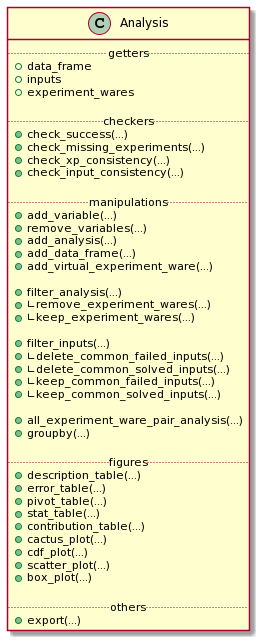

# Analyze a Campaign in *Metrics*

Once the YAML file is correctly configured ([Reading a Campaign into *Metrics*](scalpel-config.html)), the analysis of data can started.
To analyze the campaign of experiments thanks to *Metrics*, 
you need to use the *Wallet* module of *Metrics*.
*Wallet* stands for *"Automated tooL for expLoiting Experimental resulTs"*
(*wALLET*).

To manipulate data, *Wallet* uses a [*pandas Dataframe*](https://pandas.pydata.org/). 
A dataframe is a table composed of rows corresponding to experimentations (also denoted as observations) and columns corresponding to the variables/metrics of an experimentation.

It is not necessary to have any knowledge about this library to manipulate *Wallet* data but in order to have a better idea on how data are manipulated, an example of a classical analysis dataframe is given:

|    | input                                                    | experiment_ware         |   cpu_time |
|---:|:---------------------------------------------------------|:------------------------|-----------:|
|  0 | XCSP17/AllInterval/AllInterval-m1-s1/AllInterval-035.xml | BTD 19.07.01            |   0.031203 |
|  1 | XCSP17/AllInterval/AllInterval-m1-s1/AllInterval-035.xml | choco-solver 2019-09-16 |   1.51053  |
|  2 | XCSP17/AllInterval/AllInterval-m1-s1/AllInterval-035.xml | choco-solver 2019-09-20 |   1.52427  |
|  3 | XCSP17/AllInterval/AllInterval-m1-s1/AllInterval-035.xml | choco-solver 2019-06-14 |   1.60424  |
|  4 | XCSP17/AllInterval/AllInterval-m1-s1/AllInterval-035.xml | AbsCon 2019-07-23       |   3.65329  |

For the next, the documentation focuses on the analysis of a CSP solver competition ([XCSP'19](http://www.cril.univ-artois.fr/XCSP19/)).

## A Preview of What is Able to Do an `Analysis`



Globally, the Analysis object is composed of five parts:

* `getters` to get basical objects from the analysis
* `checkers` that permits to check many important information about the analysis
* `manipulations` that permits to manipulate the state of the analysis
* `figures` that permits to draw some tables and plots representing the data
* `others` that corresponds to operations like exporting.

## Create/Import/Export an Analysis

### The Classical Analysis Object

To create a new analysis, you only need to import the `Analysis` class from *Wallet* module and instantiate a new `Analysis` object with the path to the YAML configuration file:

```python
from metrics.wallet import Analysis
analysis = Analysis(input_file='path/to/xcsp19/YAML/file')
```

The analysis is composed of many variables describing the experiments: 
* necessary ones: `input`, `experiment_ware`, `cpu_time`, `timeout`
* optional ones: `Category`, `Checked answer`, `Objective function`, `Wallclock time`, `Memory`, `Solver name`, `Solver version`.

These variables permit to check the consistency and the validity of information. Some methods, called checkers, permit to operate some basic operations:

* `<analysis>.check_success(<lambda>)`: given a lambda, this method permits to check if an experiment is a success or not (this method is naturally builded and checked when the user informs it during the Scalpel step; manually inform it in the `Analysis` constructor replace the one informed in the Scalpel file);
* `<analysis>.check_missing_experiments()`: this method is automatically called by the `Analysis` constructor to replace missing experiments by unsuccessful experiments;
* `<analysis>.check_xp_consistency(<lambda>)`: given a lambda, this method permits to check the consistency for each experiment;
* `<analysis>.check_input_consistency(<lambda>)`: given a lambda, this method permits to check the consistency for each input (composed of many experiments); it asks some basic knowledge on DataFrame manipulation (an example is given by the next).

A part of these methods are automatically called, or could be mentionned, during the Analysis constructor call:

```python
from metrics.wallet import Analysis
analysis = Analysis(
    input_file='path/to/xcsp19/YAML/file',
    is_consistent_by_xp=lambda x: not x['Checked answer'] in inconsistent_returns,
    is_consistent_by_input=lambda df: len(set(df['Checked answer'].unique()) & successful_returns) < 2,
    is_success=lambda x: x['Checked answer'] in successful_returns
)
```

The `Analysis` construction warns the user when inconsistencies are found, missing data, ...:

```
1 experiment is missing and has been added as unsuccessful.
4 experiments are inconsistent and are declared as unsuccessful.
1 input is inconsistent and linked experiments are now declared as unsuccessful.
```

The analysis creates also its own variables corresponding to the previous checkings: `error`, `success`, `missing	consistent_xp` and `consistent_input`.

It exists another way to build an analysis that is presented in the `Advanced Usage` section.

### Export and Import an Analysis

At any moment, the analysis could be exported to save its state in a file:

```python
analysis.export('analysis.csv')
```

An analysis could be exported as a csv (as a `DataFrame` representation) if the `.csv` extension is precised, else the analysis is exported as a binary object.

To import an analysis from a file, we import the function `import_analysis_from_file` and use it:

```python
from metrics.wallet import import_analysis_from_file
imported_analysis = import_analysis(json_text)
```

> TODO: You can observe an example of these functions in [this notebook](https://github.com/crillab/metrics/blob/master/example/sat-competition/2019/make_analysis.ipynb).

## Manipulate the Data from Analysis

Before producing the first figures, *Wallet* proposes to manipulate the different experiments composing the dataframe.
It allows to analyze more finely the campaign.

### Generate a New Information/Variable for Each Experiment

*Wallet* can add new information to the underlying dataframe by giving a function/lambda to a mapping method of `Analysis`. For the next example, the input name corresponds to the path of the input (e.g., `/somewhere/family/input-parameters.cnf`). It could be interesting to extract the family name to use it in the rest of the analysis. For this, the method `add_variable()` from `Analysis`:

```python
import re
family_re = re.compile(r'^XCSP\d\d/(.*?)/')

new_analysis = analysis.add_variable(
    new_var='family', 
    function=lambda x: family_re.match(x['input']).group(1)
)
```

`add_variable()` takes as first parameter the name of the future created column, and as second parameter the lambda that applies the regular expression `family_re` to the variable `input` of the row `x` (the regular expression returns an object corresponding to the matching strings: `.group(1)` permits to retrieve the family name of the input).

The result (as a sample of 5 experiments with the only 2 interesting columns shown) is:
|      | input                                                        | family        |
|-----:|:-------------------------------------------------------------|:--------------|
| 3641 | XCSP17/Primes/Primes-m1-p25/Primes-25-80-2-7.xml             | Primes        |
| 2992 | XCSP17/MaxCSP/MaxCSP-maxclique-s1/MaxCSP-brock-800-2.xml     | MaxCSP        |
| 2956 | XCSP17/MagicSquare/MagicSquare-sum-s1/MagicSquare-13-sum.xml | MagicSquare   |
| 7106 | XCSP18/GracefulGraph/GracefulGraph-K05-P02_c18.xml           | GracefulGraph |
| 4423 | XCSP17/QRandom/QRandom-mdd-7-25-5/mdd-7-25-5-56-09.xml       | QRandom       |

Thanks to this method, the user is also able to update existing columns (e.g., renaming the experiment-wares to simplify their names).

> TODO: You can observe an example of this command in [this notebook](https://github.com/crillab/metrics/blob/master/example/sat-competition/2019/static_scatter_and_output.ipynb). Here, the satisfiability information from the experimentation is extracted into a `sat` column.

### Remove Variables from the Analysis

Sometimes, some analysis information are not useful: it could be interesting to simplify and lighten the dataframe (e.g., when we need export the analysis in its lightest format). To do this:

```python
analysis.remove_variables(
    vars=['Category', 'Objective function']
)
```

where `vars` parameter take the list of variables to remove.

### Add an Analysis or a DataFrame to the current Analysis

When many campaigns needs to be compared and two analysis `a1` and `a2` have been created, it is possible de merge them:

```python
a3 = a1.add_analysis(
    analysis=a2,
    is_consistent_by_xp=<lambda>,
    is_consistent_by_input=<lambda>,
    is_success=<lambda>
)
``` 

The user has to be careful to merge consistent data: the new analysis needs to contain the Cartesian product of available inputs in its dataframe with the experiment-wares. To ensure this and the consistency of its analysis, the user can also provide the lambda as described for the Analysis construction.

In the same way, it is possible to append the analysis with a consistent dataframe:

```python
a3 = a1.add_analysis(
    analysis=a2.data_frame,
    is_consistent_by_xp=<lambda>,
    is_consistent_by_input=<lambda>,
    is_success=<lambda>
)
```

### Add a Virtual Experiment-Ware

Sometimes, it may be interesting to introduce what we call a *Virtual Experiment-Ware* (VEW), which generalizes the well-known *Virtual Best Solver* (VBS).
It allows to compare our current experiment-wares to the virtual (best) one. A VBEW (*Virtual Best Experiment-Ware*) selects the best experiment for each input from a selection of real experiment-ware thanks to the function `find_best_cpu_time_input`:

```python
from metrics.wallet import find_best_cpu_time_input

analysis_plus_vbs = analysis.add_virtual_experiment_ware(
    function=find_best_cpu_time_input, 
    xp_ware_set=None, # None corresponds to the all available experiment-wares of the analysis
    name='my_best_solver'
)
```

Here, we create a VBEW named `my_best_solver` and based on the best performances of the overall set of experiment-wares. `my_best_solver` will receive the result of one of these experiment-wares minimizing the `cpu_time` column.

`find_best_cpu_time_input` is a function using some basic knownledge about dataframe. As an example, its representation is shown:

```python
def find_best_cpu_time_input(df):
    s = df['cpu_time']
    return df[s == s.min()]
```

`find_best_cpu_time_input` receives a dataframe composed of experiments for a given input. It finds the minimal `cpu_time` value and returns the row corresponding to this best time.

> TODO: You can observe an example of this method in [this notebook](https://github.com/crillab/metrics/blob/master/example/sat-competition/2019/static_cactus_and_output.ipynb). Here, we create two different VBEWs.

### Subset of `Analysis` Rows

`Analysis` is also able to make a subset of its experiments.

#### By Filtering Inputs

By default, it exists some useful subset methods in `Analysis` object to filter input (and linked experiments):

+ `keep_common_failed_inputs()`: returns a new `Analysis` with only the common failed experiments. It corresponds to inputs for which no experiment-ware has succeeded.
+ `keep_common_solved_inputs()`: returns a new `Analysis` with only the common successful experiments. It corresponds to inputs for which no experiment-ware has failed.
+ `delete_common_failed_inputs()`: returns a new `Analysis` where commonly failed inputs are removed.
+ `delete_common_solved_inputs()`: returns a new `Analysis` where commonly succeeded inputs are removed.

Finally, we present a last and generic method to make a subset of inputs:

```python
analysis.filter_inputs(
    function=<lambda>,
    how=<all|any>
)
```

The `filter_inputs` method takes two parameters:
- `function` corresponds to a True/False lambda that says if an experiment (from input experiments) is acceptable or not
- `how` corresponds to the need to have at least one or all the experiments from input acceptables.

As examples, we show how the four default methods are set with this generic one:

|Default method|Implementation|
|---|---|
|`delete_common_failed_inputs`|`analysis.filter_inputs(function=lambda x: x['success'], how='any')`|
|`delete_common_solved_inputs`|`analysis.filter_inputs(function=lambda x: not x['success'], how='any')`|
|`keep_common_failed_inputs`|`analysis.filter_inputs(function=lambda x: not x['success'], how='all')`|
|`keep_common_solved_inputs`|`analysis.filter_inputs(function=lambda x: x['success'], how='all')`|

> TODO: You can observe an example of this subset in [this notebook](https://github.com/crillab/metrics/blob/master/example/sat-competition/2019/static_cactus_and_output.ipynb). Here, we want to have a clearer view on these manifold exepriment-wares.

#### By Filtering Experiments

Analysis permits also to precise what are the experiments that the user wants to filter:

```python
analysis_no_para = analysis.filter_analysis(
    function=lambda x: 'parallel' not in x['experiment_ware']
)
```

The previous example permits to remove all the solver containing the term *parallel* in its title.

Derived from this previous generic method, some default actions are also existing:

|Default method|Implementation|
|---|---|
|`remove_experiment_wares(<set>)`|`analysis.filter_analysis(lambda x: x[EXPERIMENT_XP_WARE] not in experiment_wares)`|
|`keep_experiment_wares(<set>)`|`analysis.filter_analysis(lambda x: x[EXPERIMENT_XP_WARE] in experiment_wares)`|

### Grouping the Analysis

To group the analysis into specific analysis, two more methods are presented: the classical `groupby` method and another one to group experiment-wares by pairs.

#### `groupby` Operator

The `groupby` operator allows to create a list of new `Analysis` instances grouped by a column value. For example, if we have the family name `family` of inputs in the dataframe, it could be interesting to make separated analysis of each of them:

```python
for sub_analysis in analysis.groupby('family'):
	print(sub_analysis.description_table())
```

These previous lines will describe the analysis of each family of `my_analysis`.

#### Pairs of Experiment-wares

To compare more precisely the overall pairs of experiment-wares, a method is implemented to return the corresponding analysis:

```python
for sub_analysis in analysis.all_experiment_ware_pair_analysis():
	print(sub_analysis.description_table())
```

## Draw Figures

After having built the analysis and manipulated the data we want to highlight, we can start drawing figures. Thanks to *Wallet*, we are able to build two kinds of figures: static and dynamic.

*Wallet* permits to draw static plots and computing tables showing different statistic measures. These figures can easily be exported in a format specified by the user, such as LaTeX for tables and PNG or vectorial graphics (such as SVG or EPS) for images. Static plots are highly configurable in order to fit in their final destination (e.g., in slides or articles).

### Describe the Current Analysis

Before manipulating the analysis, it could be interesting to describe it:

```python
my_analysis.describe(
	show_experiment_wares=False,
	show_inputs=False
)
```

which yields the following:

```
This Analysis is composed of:
- 55 experiment-wares 
- 400 inputs
- 22000 experiments (0 missing -> more details: <Analysis>.get_error_table())
```

This first method allows to fastly understand how is composed the campaign. Here, simple statistics are shown, as the number of experiment-wares, inputs, or missing experiments, but one can also show exhaustively the different input and experiment-ware names (by replacing `False` by `True` for the `show_experiment_wares` and `show_experiment_wares` parameters). If it exists missing data, the *Wallet* analysis can print a table showing what are these missing experiments by calling `my_analysis.get_error_table()`.

> You can observe an example of this method in [this notebook](https://github.com/crillab/metrics/blob/master/example/sat-competition/2019/make_analysis.ipynb).

### Static Tables

*Wallet* proposes two main tables showing different kinds of statistics.

#### The Statistic Table

The first one allows to show a global overview of the results through the following statistics:

- `count` is the number of solved inputs for a given experiment-ware.
- `sum` is the time taken by the experiment-ware to solve (or not) inputs (including timeout inputs).
- `PARx` is equivalent to `sum` but adds a penalty of `x` times the timeout to failed experiments (*PAR* stands for *Penalised Average Runtime*).
- `common count` is the number of inputs commonly solved by all the experiment-wares.
- `common sum` is the time taken to solve the commonly solved inputs.
- `uncommon count` corresponds to the number of inputs solved by an experiment-ware less the common ones (the common ones could be considered as easy inputs).

```python
my_analysis.get_stat_table(
    par=[2, 10]

    output='path/for/the/output.tex', # output path or None
    
    dollars_for_number=True, # 123456789 -> $123456789$
    commas_for_number=True,  # 123456789 -> 123,456,789
    
    xp_ware_name_map=None, # a map to rename experiment-wares
)
```

This first table is given by calling the previous method with different parameters:
- `par` corresponds to the different values we want to give to the PARx column(s).
- `output` is the path to the output we want to produce (e.g., a LaTeX table).
- `dollars_for_number` puts numbers in math mode (for LaTeX outputs).
- `commas_for_number` splits numbers with commas in math mode (for LaTeX outputs).
- `xp_ware_name_map` is a map allowing to rename each experiment-ware names in the output table.

> A statistic table is given in [this notebook](https://github.com/crillab/metrics/blob/master/example/sat-competition/2019/tables_and_output.ipynb).

#### The Contribution Table

The second table proposed by *Wallet* allowing to show the **contribution** of each experiment-ware:

- `vbew simple` corresponds to the number of times an experiment-ware has been selected in the VBEW.
- `vbew d` corresponds to the number of times an experiment-ware solves an instance `d` second(s) faster than all other solvers.
- `contribution` corresponds to the case that an experiment-ware is the only one that has been able to solve an input (a.k.a. state-of-the-art contribution).

As for the previous table, one just needs to call the following method:

```python
my_analysis.get_contribution_table(
    output='path/for/the/output.tex', # output path or None
    
    deltas=[1, 10, 100], # minimum resolution cpu_time for the vbew
    
    dollars_for_number=True, # if True, 123456789 -> $123456789$
    commas_for_number=True,  # if True, 123456789 -> 123,456,789
    
    xp_ware_name_map=None, # a map to rename experiment-wares
)
```

`deltas` correspond to the list of `vbew d` we want to show in the table.

> A contribution table is given in [this notebook](https://github.com/crillab/metrics/blob/master/example/sat-competition/2019/tables_and_output.ipynb).

### Static Plots

*Wallet* proposed many plots to show data. Static plots have some common parameters:

- `output`: output path to save the figure or `None`.
- `figsize`: size of the figure to output (inches).
- `color_map`: a map to force the color of each experiment-ware line.
- `style_map`: a map to force the line style of each experiment-ware line.
- `xp_ware_name_map`: a map to rename the experiment-wares.
- `font_name`: the font name to set.
- `font_size`: the size name to set.
- `font_color`: the font color to set.
- `latex_writing`: if `True`, allows to write in LaTeX mode.
- `logx`: log scale for the x-axis.
- `logy`: log scale for the y-axis.
- `[x|y]_[min|max]`: set the limit of an axis, or `-1` to take the default value of `matplotlib`.
- `legend_location` and `bbox_to_anchor`: see the [`matplotlib` documentation for legend placement](https://matplotlib.org/3.1.1/tutorials/intermediate/legend_guide.html#legend-location).
- `ncol_legend`: number of columns for the legend (default: `1`).

#### Static Cactus-Plot

A first kind of plots that allows to consider an overview of all the
experiment-wares is the *cactus plot*. A cactus plot considers all solved inputs of each
experiment-ware. Each line in the plot represents an experiment-ware. Inputs are
ordered by solving time for each experiment-ware to build this figure: the x-axis
corresponds to the rank of the solved input and the y-axis to the time taken to
solve the input, so that the righter the line, the better the solver. Note that
we can also cumulate the runtime of each solved inputs to get a smoother plot.

```python
sub_analysis.get_cactus_plot(
    cactus_col='cpu_time', # column permitting to draw lines of the cactus
    cumulated=False,       # cumulate or not the cactus_col value
    show_marker=False,     # show a marker for each experiment
    
    output='output/cactus_zoom.pdf', # output path or None
    figsize=(10,7),                  # size of the figure to output (inch)
    
    color_map=xpware_color,        # a map to force the color of each experiment-ware line
    style_map=xpware_type,         # a map to force forces the line style of each experiment-ware line
    xp_ware_name_map=xpware_map,   # a map to rename experiment-wares
    
    # font properties
    font_name='Times New Roman',
    font_size=12,
    font_color='#000000',
    latex_writing=True, # if True, permits to write in latex mode (make attention to some characters)
    
    logx=False, # log scale to x-axis
    logy=False, # log scale to y-axis
    
    # set the limit of axis, or -1 to take the default value of matplotlib
    x_min=200,
    x_max=-1,
    y_min=-1,
    y_max=-1,
    
    # matplotlib legend location
    legend_location='best',
    bbox_to_anchor=None,
    ncol_legend=1,
)
```

By default, the cactus plot draws its graphic by using the `cpu_time` of the results: you are free to change this behaviour by replacing the `cactus_col` parameter. You can ask this plot to cumulate the runtime by giving `cumulated=True`. We can show and hide markers thanks to `show_marker` parameter.

> A full example of a static cactus-plot is given in [this notebook](https://github.com/crillab/metrics/blob/master/example/sat-competition/2019/static_cactus_and_output.ipynb).

#### Static CDF-Plot

Equivalently to cactus plot, one may instead use the so-called *Cumulative Distribution Function*
(CDF), which is well-known when considering statistics.
In this plot x-axis corresponds to the y-axis of the cactus-plot (time), and the y-axis corresponds to
the normalized number of solved inputs.
A point on the line of the CDF may be interpreted as the probability to solve an input given a time limit.

```python
my_analysis.get_cdf( # CDF = Cumulative distributive Function
    cdf_col='cpu_time', 
    
    output='output/cdf.pdf', # output path or None
    figsize=(15,10),         # size of the figure to output (inch)
    
    color_map=None, 
    style_map=None,
    xp_ware_name_map=None, # a map to rename experiment-wares
    
    # font properties
    font_name='Times New Roman',
    font_size=11,
    font_color='#000000',
    latex_writing=False, # if True, permits to write in latex mode (make attention to some characters)
    
    logx=False, # log scale to x-axis
    logy=False, # log scale to y-axis
    
    # set the limit of axis, or -1 to take the default value of matplotlib
    x_min=-1,
    y_min=-1,
    x_max=-1,
    y_max=.65,
    
    # matplotlib legend location
    legend_location="upper center",
    bbox_to_anchor=(0.5, -0.06),
    ncol_legend=3,
)
```

By default, the CDF plot draws its graphic by using the `cpu_time` of results: you are free to change this behaviour by replacing the `cdf_col` parameter.

> A full example of a static CDF-plot is given in [this notebook](https://github.com/crillab/metrics/blob/master/example/sat-competition/2019/static_cdf_and_output.ipynb).

#### Static Box-Plot

In addition to cactus and CDF plots, one may consider *box plots*
to get more detailed results about the runtime of each solver. A
box in such a plot represents the distribution of each experiment time of a
given experiment-ware. In particular, such plots allow to easily locate medians,
quartiles and means for all experiment-wares in a single figure.
We can find a practical application of this plot in the case of randomized algorithms: 
it permits to visualize the variance and to simply compare the effect of changing 
the random function seed for a given fixed solver configuration using it.

```python
my_analysis.get_box_plot( 
    box_col='cpu_time',
    
    output='output/box.pdf', # output path or None
    figsize=(15,10),         # size of the figure to output (inch)
    
    xp_ware_name_map=xpware_map, # a map to rename experiment-wares
    
    # font properties
    font_name='DejaVu Sans',
    font_size=11,
    font_color='#000000',
    latex_writing=True, # if True, permits to write in latex mode (make attention to some characters)
    
    logy=True, # log scale to y-axis
)
```

By default, the box plot draw its graphic by using the `cpu_time` of results: the user is free to change this behaviour by replacing the `cdf_col` parameter.

> A full example of a static box-plot is given in [this notebook](https://github.com/crillab/metrics/blob/master/example/sat-competition/2019/static_box_and_output.ipynb).

#### Static Scatter-Plot

Finally, to get a more detailed comparison of two experiment-wares, one can use
scatter plots. Each axis in
this plot corresponds to an experiment-ware and displays its runtime (between
$`0`$ and the timeout). We can place each input in the plot as a point
corresponding to the time taken by both experiment-wares to solve this input. We
can quickly observe if there exists a trend for one experiment-ware or the other in
terms of efficiency.

```python
my_analysis.get_scatter_plot(
    xp_ware_x='CaDiCaL default', 
    xp_ware_y='MapleLCMDistChronoBT-DL-v2.2 default',
    scatter_col='cpu_time',
    
    # We precise here the new created column to take into account
    color_col='sat',
    
    output='output/scatter.pdf',
    figsize=(7,6),
    
    xp_ware_name_map=xpware_map,
    
    font_name='DejaVu Sans',
    font_size=11,
    font_color='#000000',
    latex_writing=True,
    
    logx=True,
    logy=True,
    
    x_min=-1,
    y_min=-1,
    x_max=-1,
    y_max=-1,
)
```

To draw a scatter-plot, we need to specify the experiment-wares on the x-axis and tge y-axis: `xp_ware_x` and `xp_ware_y`. By default, the scatter plot draw its graphic by using the `cpu_time` of results: you are free to change this behaviour by replacing the `cdf_col` parameter.

> A full example of a static scatter-plot is given in [this notebook](https://github.com/crillab/metrics/blob/master/example/sat-competition/2019/static_scatter_and_output.ipynb).

### Dynamic Plots

Dynamic plots can be called by simply giving a new parameter of these previous static figures `dynamic`.

For example:

```python
my_analysis.get_scatter_plot(dynamic=True)
```

> A global view of the dynamic plots is given in [this notebook](https://github.com/crillab/metrics/blob/master/example/sat-competition/2019/dynamic_analysis.ipynb).

## Advanced Usage

For a more advanced usage, it is possible to get the original *pandas Dataframe* and to manipulate it thanks to this instruction:

```python
df = analysis.data_frame
```

Then simply foloow [*pandas documentation*](https://pandas.pydata.org/docs/) or more concisely this [*pandas cheat sheet*](https://pandas.pydata.org/Pandas_Cheat_Sheet.pdf).

If the user keeps the minimal necessary information in the modified dataframe, a new `Analysis` could be instanciated (with the optional success and consistency lambda checkers):

```python
analysis = Analysis(
    data_frame=modified_df,
    is_consistent_by_xp=<lambda>,
    is_consistent_by_input=<lambda>,
    is_success=<lambda>
)
```
