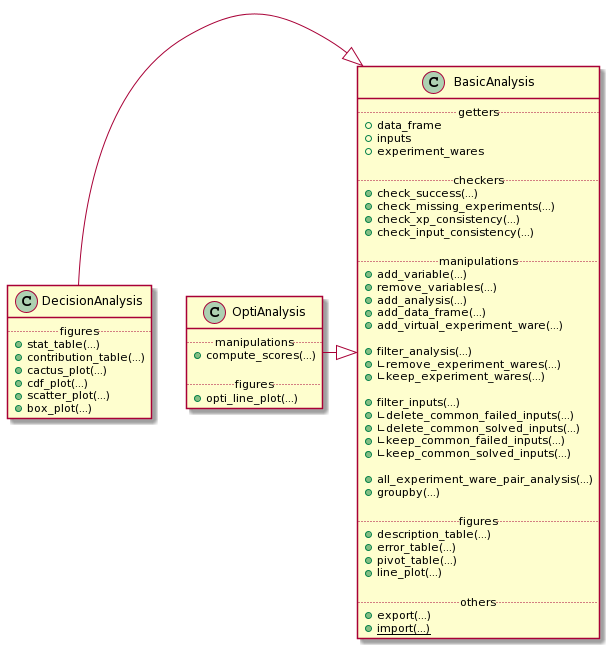
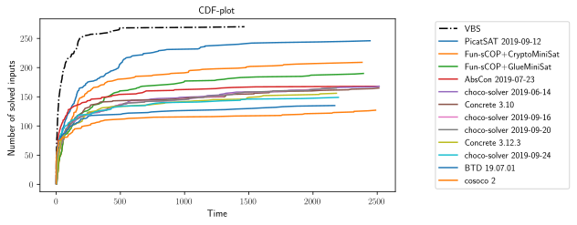

# Analyze a Campaign in *Metrics*

Once the YAML file is correctly configured ([Reading a Campaign into *Metrics*](scalpel-config.md)), the analysis of data can started.
To analyze the campaign of experiments thanks to *Metrics*, 
you need to use the *Wallet* module of *Metrics*.
*Wallet* stands for *"Automated tooL for expLoiting Experimental resulTs"*
(*wALLET*).

To manipulate data, *Wallet* uses a [*pandas Dataframe*](https://pandas.pydata.org/). 
A dataframe is a table composed of rows corresponding to experimentations (also denoted as observations) and columns corresponding to the variables/metrics of an experimentation.

It is not necessary to have wide knowledge about this library to manipulate *Wallet* data but in order to have a better idea on how data are manipulated, an example of a classical analysis dataframe is given:

|    | input                                                    | experiment_ware         |   cpu_time |
|---:|:---------------------------------------------------------|:------------------------|-----------:|
|  0 | XCSP17/AllInterval/AllInterval-m1-s1/AllInterval-035.xml | BTD 19.07.01            |   0.031203 |
|  1 | XCSP17/AllInterval/AllInterval-m1-s1/AllInterval-035.xml | choco-solver 2019-09-16 |   1.51053  |
|  2 | XCSP17/AllInterval/AllInterval-m1-s1/AllInterval-035.xml | choco-solver 2019-09-20 |   1.52427  |
|  3 | XCSP17/AllInterval/AllInterval-m1-s1/AllInterval-035.xml | choco-solver 2019-06-14 |   1.60424  |
|  4 | XCSP17/AllInterval/AllInterval-m1-s1/AllInterval-035.xml | AbsCon 2019-07-23       |   3.65329  |

For the next, the documentation focuses on the analysis of a CSP solver competition ([XCSP'19](http://www.cril.univ-artois.fr/XCSP19/)).

## A Preview of What is Able to Do an `Analysis`



Globally, an *Analysis object is composed of five parts:

* `getters` to get basical objects from the analysis
* `checkers` that permit to check many important information about the analysis
* `manipulations` that permit to manipulate the state of the analysis
* `figures` that permit to draw some tables and plots representing the data
* `others` that correspond to operations like exporting.

Here, an analysis id divided in three different objects:

* `BasicAnalysis` is an analysis with the only constraint of a complete cartesian product between inputs and experiment-wares
* `DecisionAnalysis` is an analysis taking into account the time and the success, or not, of each experiment
* `OptiAnalysis` is an analysis of an optimality problem taking into account the list of bound and timestamps, and the success, or not, of each experiment

A `BasicAnalysis` could be used openly without the constraint of success, time, or bound list information.

In this tutorial, we firstly focus on a `DecisionAnalysis` with the inherited methods from a `BasicAnalysis`.

A final part focuses on the optimality analysis of the object `OptiAnalysis`.

## Create/Import/Export a DecisionAnalysis

### The DecisionAnalysis Object

To create a new analysis, you only need to import the `DecisionAnalysis` class from *Wallet* module and instantiate a new `DecisionAnalysis` object with the path to the YAML configuration file:

```python
from metrics.wallet import BasicAnalysis

analysis = DecisionAnalysis(input_file='path/to/xcsp19/YAML/file')
```

The analysis is composed of many variables describing the experiments: 
* necessary ones: `input`, `experiment_ware`, `cpu_time`, `timeout`
* optional ones (given by the current competition file): `Category`, `Checked answer`, `Objective function`, `Wallclock time`, `Memory`, `Solver name`, `Solver version`.

These variables permit to check the consistency and the validity of information. Some methods, called checkers, permit to operate some basic operations:

* `<analysis>.check_success(<lambda>)`: given a lambda, this method permits to check if an experiment is a success or not (this method is automatically executed when the user has informed it in the Scalpel file);
* `<analysis>.check_missing_experiments()`: this method is automatically called by the `*Analysis` constructor to replace missing experiments by unsuccessful experiments;
* `<analysis>.check_xp_consistency(<lambda>)`: given a lambda, this method permits to check the consistency for each experiment;
* `<analysis>.check_input_consistency(<lambda>)`: given a lambda, this method permits to check the consistency for each input (composed of many experiments); it asks some basic knowledge on DataFrame manipulation (an example is given by the next).

`check_success` and `check_missing_experiments` are automatically called during the `*Analysis` constructor call. After, the user could (re-)check these success and consistency methods as follow:

```python
inconsistent_returns = {
    'ERR WRONGCERT', 'ERR UNSAT'
}

successful_returns = {'SAT', 'UNSAT'}

is_consistent_by_xp = (lambda x: not x['Checked answer'] in inconsistent_returns)
is_consistent_by_input = (lambda df: len(set(df['Checked answer'].unique()) & successful_returns) < 2)
is_success = (lambda x: x['Checked answer'] in successful_returns)

analysis.check_success(is_success)
analysis.check_input_consistency(is_consistent_by_input)
analysis.check_xp_consistency(is_consistent_by_xp)
```

The `*Analysis` construction warns the user when inconsistencies are found, missing data, ...:

```
1 experiment is missing and has been added as unsuccessful.
4 experiments are inconsistent and are declared as unsuccessful.
1 input is inconsistent and linked experiments are now declared as unsuccessful.
```

The analysis creates also its own variables corresponding to the previous checkings: `error`, `success`, `missing`	`consistent_xp` and `consistent_input`.

It exists another way to build an analysis that is presented in the `Advanced Usage` section.

### Export and Import an Analysis

At any moment, the analysis could be exported to save its state into a file:

```python
analysis.export('analysis.csv')
```

An analysis could be exported as a csv (as a `DataFrame` representation) if the `.csv` extension is precised, else the analysis is exported as a binary object.

To import an analysis from a file, the function `import_analysis_from_file` is imported:

```python
imported_analysis = DecisionAnalysis.import_from_file(filepath)
```

> You can observe an example of these functions in [this notebook](https://github.com/crillab/metrics/blob/master/example/example/xcsp-19/create_analysis.ipynb).

## Manipulate the Data from *Analysis

Before producing the first figures, *Wallet* proposes to manipulate the different experiments composing the dataframe.
It allows to analyze more finely the campaign.

### Generate a New Information/Variable for Each Experiment

*Wallet* can add new information to the underlying dataframe by giving a function/lambda to a mapping method of `BasicAnalysis`. For the next example, the input name corresponds to the path of the input (e.g., `/XCSPxx/family/.../input-parameters.xcsp`). It could be interesting to extract the family name to use it in the rest of the analysis. For this, the method `add_variable()` from `BasicAnalysis`:

```python
import re
family_re = re.compile(r'^XCSP\d\d/(.*?)/')

new_analysis = analysis.add_variable(
    new_var='family', 
    function=lambda x: family_re.match(x['input']).group(1)
)
```

`add_variable()` takes as first parameter the name of the future created column, and as second parameter the lambda that applies the regular expression `family_re` to the variable `input` of the row `x` (the regular expression returns an object corresponding to the matching strings: `.group(1)` permits to retrieve the family name of the input).

The result (as a sample of 5 experiments with the only 2 interesting columns shown) is:

|      | input                                                        | family        |
|-----:|:-------------------------------------------------------------|:--------------|
| 3641 | XCSP17/Primes/Primes-m1-p25/Primes-25-80-2-7.xml             | Primes        |
| 2992 | XCSP17/MaxCSP/MaxCSP-maxclique-s1/MaxCSP-brock-800-2.xml     | MaxCSP        |
| 2956 | XCSP17/MagicSquare/MagicSquare-sum-s1/MagicSquare-13-sum.xml | MagicSquare   |
| 7106 | XCSP18/GracefulGraph/GracefulGraph-K05-P02_c18.xml           | GracefulGraph |
| 4423 | XCSP17/QRandom/QRandom-mdd-7-25-5/mdd-7-25-5-56-09.xml       | QRandom       |

Thanks to this method, the user is also able to update existing columns (e.g., renaming the experiment-wares to simplify their names).

> You can observe an example of this command in [this notebook](https://github.com/crillab/metrics/blob/master/example/xcsp-19/create_analysis.ipynb).

### Remove Variables from the Analysis

Sometimes, some analysis information are not useful: it could be interesting to simplify and lighten the dataframe (e.g., when we need to export the analysis in a lighter format). To do this:

```python
analysis.remove_variables(
    vars=['Category', 'Objective function']
)
```

where `vars` parameter take the list of variables to remove.

### Add an Analysis or a DataFrame to the current Analysis

When many campaigns needs to be compared and two analysis `a1` and `a2` have been created, it is possible de merge them:

```python
a3 = a1.add_analysis(a2)
``` 

The user has to be careful to merge consistent data: the new analysis needs to contain the Cartesian product of the available inputs in its dataframe with the experiment-wares. To ensure this and the consistency of its analysis, the user can also apply the lambda as described for the Analysis construction.

In the same way, it is possible to append the analysis with a consistent dataframe:

```python
a3 = a1.add_data_frame(a2.data_frame)
```

### Add a Virtual Experiment-Ware

Sometimes, it may be interesting to introduce what we call a *Virtual Experiment-Ware* (VEW), which generalizes the well-known *Virtual Best Solver* (VBS).
It allows to compare our current experiment-wares to the virtual (best) one. A VBEW (*Virtual Best Experiment-Ware*) selects the best experiment for each input from a selection of real experiment-ware thanks to the function `find_best_cpu_time_input`:

```python
from metrics.wallet import find_best_cpu_time_input

analysis_plus_vbs = analysis.add_virtual_experiment_ware(
    function=find_best_cpu_time_input, 
    xp_ware_set=None, # None corresponds to the all available experiment-wares of the analysis
    name='my_best_solver'
)
```

Here, we create a VBEW named `my_best_solver` and based on the best performances of the overall set of experiment-wares. `my_best_solver` will receive the result of one of these experiment-wares minimizing the `cpu_time` column.

`find_best_cpu_time_input` is a function using some basic knownledge about dataframe. As an example, `find_best_cpu_time_input` representation is shown:

```python
def find_best_cpu_time_input(df):
    s = df['cpu_time']
    return df[s == s.min()]
```

`find_best_cpu_time_input` receives a dataframe composed of the experiments composing a given input. It finds the minimal `cpu_time` value and returns the row corresponding to this best time.

> You can observe an example of this method in [this notebook](https://github.com/crillab/metrics/blob/master/example/example/xcsp-19/create_analysis.ipynb).

### Subset of `*Analysis` Rows

`*Analysis` is also able to make a subset of its experiments.

#### By Filtering Inputs

By default, it exists some useful subset methods in `*Analysis` object to filter inputs (and linked experiments):

+ `keep_common_failed_inputs()`: returns a new `*Analysis` with only the common failed experiments. It corresponds to inputs for which no experiment-ware has succeeded;
+ `keep_common_solved_inputs()`: returns a new `*Analysis` with only the common successful experiments. It corresponds to inputs for which no experiment-ware has failed;
+ `delete_common_failed_inputs()`: returns a new `*Analysis` where commonly failed inputs are removed;
+ `delete_common_solved_inputs()`: returns a new `*Analysis` where commonly succeeded inputs are removed.

Finally, we present a last and generic method to make a subset of inputs:

```python
analysis.filter_inputs(
    function=<lambda>,
    how=<"all"|"any">
)
```

The `filter_inputs` method takes two parameters:
- `function` corresponds to a True/False lambda that says if an experiment (from input experiments) is acceptable or not
- `how` corresponds to the need to have at least one or all the experiments from input acceptables.

As examples, we show how the four default methods are set with this generic one:

|Default method|Implementation|
|---|---|
|`delete_common_failed_inputs`|`analysis.filter_inputs(function=lambda x: x['success'], how='any')`|
|`delete_common_solved_inputs`|`analysis.filter_inputs(function=lambda x: not x['success'], how='any')`|
|`keep_common_failed_inputs`|`analysis.filter_inputs(function=lambda x: not x['success'], how='all')`|
|`keep_common_solved_inputs`|`analysis.filter_inputs(function=lambda x: x['success'], how='all')`|

> You can observe an example of this subset in [this notebook](https://github.com/crillab/metrics/blob/master/example/example/xcsp-19/create_analysis.ipynb).

#### By Filtering Experiments

Analysis permits also to precise what are the experiments that the user wants to filter:

```python
analysis_no_para = analysis.filter_analysis(
    function=lambda x: 'parallel' not in x['experiment_ware']
)
```

The previous example permits to remove all the solvers containing the term *parallel* in its title.

Derived from this previous generic method, some default actions are also existing:

|Default method|Implementation|
|---|---|
|`remove_experiment_wares(<set>)`|`analysis.filter_analysis(lambda x: x[EXPERIMENT_XP_WARE] not in experiment_wares)`|
|`keep_experiment_wares(<set>)`|`analysis.filter_analysis(lambda x: x[EXPERIMENT_XP_WARE] in experiment_wares)`|

### Grouping the Analysis

To group the analysis into specific analysis, two more methods are presented: the classical `groupby` method and another one to group experiment-wares by pairs.

#### `groupby` Operator

The `groupby` operator allows to create a list of new `*Analysis` instances grouped by a column value. For example, if we have the family name `family` of inputs in the dataframe, it could be interesting to make separated analysis of each of them:

```python
for sub_analysis in analysis.groupby('family'):
	print(sub_analysis.description_table())
```

These previous lines will describe the analysis of each family of `my_analysis`.

#### Pairs of Experiment-wares

To compare more precisely the overall pairs of experiment-wares, a method is implemented to return the corresponding analysis:

```python
for sub_analysis in analysis.all_experiment_ware_pair_analysis():
	print(sub_analysis.description_table())
```

## Draw Figures

After having built the analysis and manipulated the data we want to highlight, we can start drawing figures. Thanks to *Wallet*, we are able to build two kinds of plots: static and dynamic.

*Wallet* permits to draw static plots and computing tables showing different statistic measures. These figures can easily be exported in a format specified by the user, such as LaTeX for tables and PNG or vectorial graphics (such as SVG or EPS) for plots. Static plots are highly configurable in order to fit in their final destination (e.g., in slides or articles).

### Static Tables

Each table that will be described hereafter are exportable into the LaTeX format. In addition to this transformation, it is possible to personnalize the the number pattern:

- `dollars_for_number` puts numbers in math mode (for LaTeX outputs);
- `commas_for_number` splits numbers with commas in math mode (for LaTeX outputs).

> Each table generated are observable in [this notebook](https://github.com/crillab/metrics/blob/master/example/example/xcsp-19/tables_from_analysis.ipynb).

#### Describe the Current Analysis

Before manipulating the analysis, it could be interesting to describe it:

```python
analysis.description_table()
```

which yields the following:

|                                | analysis                                      |
|:-------------------------------|:----------------------------------------------|
| n_experiment_wares             | 13                                            |
| n_inputs                       | 300                                           |
| n_experiments                  | 3900                                          |
| n_missing_xp                   | 0                                             |
| n_inconsistent_xp              | 2                                             |
| n_inconsistent_xp_due_to_input | 0                                             |
| more_info_about_variables      | <analysis>.data_frame.describe(include='all') |

This first method allows to fastly understand how is composed the campaign. Here, simple statistics are shown, as the number of experiment-wares, inputs, experiments or missing ones, but one can also show exhaustively the different variable descriptions by applying `<analysis>.data_frame.describe(include='all')`. 

#### Describe the Errors

If it exists missing data, the *Wallet* analysis can print a table showing what are these missing experiments by calling:

```python
analysis.error_table()
```

which yields the following:

|      | input                   | experiment_ware         |    cpu_time | Checked answer   |   Wallclock time |      Memory | Solver name   | Solver version   |   timeout | success   | user_success   | missing   | consistent_xp   | consistent_input   | error   | family   |
|-----:|:------------------------|:------------------------|------------:|:-----------------|-----------------:|------------:|:--------------|:-----------------|----------:|:----------|:---------------|:----------|:----------------|:-------------------|:--------|:---------|
| 3576 | XCSP19/hcp/graph255.xml | cosoco 2                |    0.045418 | ERR UNSAT        |        0.0451421 | 0           | cosoco        | 2                |      2400 | False     | False          | False     | False           | True               | True    | hcp      |
| 3596 | XCSP19/hcp/graph48.xml  | choco-solver 2019-09-16 | 2306.85     | ERR WRONGCERT    |      583.697     | 1.55305e+07 | choco-solver  | 2019-09-16       |      2400 | False     | False          | False     | False           | True               | True    | hcp      |

#### The Statistic Table

The table allows to show a global overview of the results through the following statistics:

- `count` is the number of solved inputs for a given experiment-ware;
- `sum` is the time taken by the experiment-ware to solve (or not) inputs (including timeout inputs);
- `PARx` is equivalent to `sum` but adds a penalty of `x` times the timeout to failed experiments (*PAR* stands for *Penalised Average Runtime*);
- `common count` is the number of inputs commonly solved by all the experiment-wares;
- `common sum` is the time taken to solve the commonly solved inputs;
- `uncommon count` corresponds to the number of inputs solved by an experiment-ware less the common ones (the common ones could be considered as easy inputs);
- `total` the total number of experiments for a given experiment-ware.

```python
analysis.stat_table(
    output='output/stat_table.tex',
    commas_for_number=True,
    dollars_for_number=True,
)
```

This table is given by calling the previous method with different parameters:
- `par` corresponds to the different values we want to give to the PARx column(s);
- `output` is the path to the output we want to produce (e.g., a LaTeX table).

| experiment_ware                            |   count |    sum |   PAR1 |   PAR2 |            PAR10 |   common count |   common sum |   uncommon count |   total |
|:-------------------------------------------|--------:|-------:|-------:|-------:|-----------------:|---------------:|-------------:|-----------------:|--------:|
| VBS                                        |     270 |  90388 |  90388 | 162388 | 738388           |             65 |          405 |              205 |     300 |
| PicatSAT 2019-09-12                        |     246 | 192377 | 192377 | 321977 |      1.35878e+06 |             65 |        11093 |              181 |     300 |
| Fun-sCOP hybrid+CryptoMiniSat (2019-06-15) |     209 | 274323 | 274323 | 492723 |      2.23992e+06 |             65 |        16472 |              144 |     300 |
| Fun-sCOP order+GlueMiniSat (2019-06-15)    |     190 | 320070 | 320070 | 584070 |      2.69607e+06 |             65 |        14632 |              125 |     300 |
| AbsCon 2019-07-23                          |     168 | 341387 | 341387 | 658187 |      3.19259e+06 |             65 |         2805 |              103 |     300 |
| choco-solver 2019-06-14                    |     168 | 369846 | 369846 | 686646 |      3.22105e+06 |             65 |         7875 |              103 |     300 |
| Concrete 3.10                              |     165 | 369615 | 369615 | 693615 |      3.28562e+06 |             65 |         5182 |              100 |     300 |
| choco-solver 2019-09-16                    |     165 | 372266 | 372266 | 696266 |      3.28827e+06 |             65 |         7790 |              100 |     300 |
| choco-solver 2019-09-20                    |     165 | 372316 | 372316 | 696316 |      3.28832e+06 |             65 |         7754 |              100 |     300 |
| Concrete 3.12.3                            |     156 | 386276 | 386276 | 731876 |      3.49668e+06 |             65 |         7198 |               91 |     300 |
| choco-solver 2019-09-24                    |     149 | 390634 | 390634 | 753034 |      3.65223e+06 |             65 |         2570 |               84 |     300 |
| BTD 19.07.01                               |     135 | 421087 | 421087 | 817087 |      3.98509e+06 |             65 |         6718 |               70 |     300 |
| cosoco 2                                   |     127 | 448425 | 448425 | 863625 |      4.18522e+06 |             65 |         6810 |               62 |     300 |

#### The Pivot Table

The pivot table allows to show exhaustively a precise variable between the set of experiment-wares (rows) and inputs (cols).

```python
analysis.pivot_table(
    index='input', 
    columns='experiment_ware', 
    values='cpu_time',
    output='output/pivot_table.tex',
    commas_for_number=True,
    dollars_for_number=True,
)#.head()
```

- `index` permits to precise what we want in the rows;
- `columns` permits to precise what we want in the cols;
- `values` permits to precise what we want to show in the cells as information crossing `index` and `columns`.

| input                                                    |   AbsCon 2019-07-23 |   BTD 19.07.01 |   Concrete 3.10 |   Concrete 3.12.3 |   Fun-sCOP hybrid+CryptoMiniSat (2019-06-15) |   Fun-sCOP order+GlueMiniSat (2019-06-15) |   PicatSAT 2019-09-12 |        VBS |   choco-solver 2019-06-14 |   choco-solver 2019-09-16 |   choco-solver 2019-09-20 |   choco-solver 2019-09-24 |    cosoco 2 |
|:---------------------------------------------------------|--------------------:|---------------:|----------------:|------------------:|---------------------------------------------:|------------------------------------------:|----------------------:|-----------:|--------------------------:|--------------------------:|--------------------------:|--------------------------:|------------:|
| XCSP17/AllInterval/AllInterval-m1-s1/AllInterval-035.xml |             3.65329 |       0.031203 |         81.2146 |           9.80993 |                                      11.6944 |                                   14.1492 |              228.644  |   0.031203 |                   1.60424 |                   1.51053 |                   1.52427 |                   69.1219 |   14.919    |
| XCSP17/AllInterval/AllInterval-m1-s1/AllInterval-040.xml |             3.77132 |       0.045375 |        127.241  |         189.841   |                                      14.8833 |                                   14.6022 |              290.328  |   0.045375 |                   1.68856 |                   1.75339 |                   1.57938 |                   46.7505 |    0.347661 |
| XCSP17/Bibd/Bibd-sc-open/Bibd-sc-85-085-36-36-15.xml     |          2520.04    |    2519.91     |       2520.16   |        2520.2     |                                    2520.44   |                                 2520.28   |             2520.07   | 140.442    |                2520.42    |                2520.66    |                2520.74    |                 2520.05   |  140.442    |
| XCSP17/Bibd/Bibd-sc-stab1/Bibd-sc-25-05-01.xml           |          2520.1     |    2519.89     |       2520.11   |        2520.12    |                                      45.027  |                                   43.2998 |               21.1751 |  21.1751   |                2520.63    |                1666.8     |                1680.89    |                  379.265  | 2519.75     |
| XCSP17/Bibd/Bibd-sc-stab1/Bibd-sc-25-09-03.xml           |          2520.11    |    2519.77     |       2520.1    |        2520.07    |                                    1689.17   |                                 2520.14   |              515.664  | 137.506    |                 137.506   |                 260.369   |                 211.421   |                 2520.11   | 2520.02     |

The output is truncated.

#### The Contribution Table

This last table proposed by *Wallet* allowing to show the **contribution** of each experiment-ware:

- `vbew simple` corresponds to the number of times an experiment-ware has been selected in the VBEW;
- `vbew d` corresponds to the number of times an experiment-ware solves an instance `d` second(s) faster than all other solvers;
- `contribution` corresponds to the case that an experiment-ware is the only one that has been able to solve an input (a.k.a. state-of-the-art contribution).

As for the previous table, one just needs to call the following method:

```python
analysis.remove_experiment_wares(['VBS']).contribution_table(
    output='output/contribution_table.tex',
    commas_for_number=True,
    dollars_for_number=True,
)
```

NB: the previously created virtual experiment-ware *VBS* is removed to avoid errors in the computations.

`deltas` correspond to the list of `vbew d` we want to show in the table.

| experiment_ware                            |   vbew simple |   vbew 1s |   vbew 10s |   vbew 100s |   contribution |
|:-------------------------------------------|--------------:|----------:|-----------:|------------:|---------------:|
| BTD 19.07.01                               |            76 |        28 |         11 |           1 |              0 |
| cosoco 2                                   |            59 |        35 |         17 |           9 |              5 |
| PicatSAT 2019-09-12                        |            40 |        35 |         30 |           9 |              0 |
| Fun-sCOP hybrid+CryptoMiniSat (2019-06-15) |            38 |        38 |         35 |          18 |              0 |
| AbsCon 2019-07-23                          |            19 |        19 |         15 |           1 |              0 |
| Fun-sCOP order+GlueMiniSat (2019-06-15)    |            16 |        16 |         11 |           5 |              3 |
| choco-solver 2019-09-24                    |            14 |        14 |          6 |           1 |              0 |
| choco-solver 2019-06-14                    |             7 |         6 |          5 |           3 |              0 |
| Concrete 3.10                              |             6 |         6 |          5 |           1 |              0 |
| Concrete 3.12.3                            |             4 |         4 |          4 |           0 |              0 |
| choco-solver 2019-09-16                    |             3 |         3 |          2 |           1 |              0 |
| choco-solver 2019-09-20                    |             1 |         1 |          1 |           0 |              0 |

### Static Plots

*Wallet* proposed many plots to show data. Static plots have some common parameters:

- `figure_size`: size of the figure to output (inches);
- `title`: the figure title;
- `x_axis_name`: the x-label title;
- `y_axis_name`: the y-label title;
- `output`: output path to save the figure or `None`;
- `color_map`: a map to force the color of each experiment-ware line;
- `style_map`: a map to force the line style of each experiment-ware line;
- `title_font_*`: the title font properties;
- `label_font_*`: the label font properties;
- `latex_writing`: if `True`, allows to write in LaTeX mode;
- `logx`: log scale for the x-axis;
- `logy`: log scale for the y-axis;
- `[x|y]_[min|max]`: set the limit of an axis, or `-1` to take the default value of `matplotlib`;
- `legend_location`: the four legend positions (Position.RIGHT, Position.LEFT, Position.TOP, Position.BOTTOM);
- `legend_offset`: a couple `x` and `y` as offsets for the current legend location;
- `ncol_legend`: number of columns for the legend (default: `1`).

> A full example of a static plots is given in [this notebook](https://github.com/crillab/metrics/blob/master/example/example/xcsp-19/figures_from_analysis.ipynb).

#### Static Cactus-Plot

A first kind of plots that allows to consider an overview of all the
experiment-wares is the *cactus plot*. A cactus plot considers all solved inputs of each
experiment-ware. Each line in the plot represents an experiment-ware. Inputs are
ordered by solving time for each experiment-ware to build this figure: the x-axis
corresponds to the rank of the solved input and the y-axis to the time taken to
solve the input, so that the righter the line, the better the solver. Note that
we can also cumulate the runtime of each solved inputs to get a smoother plot.

```python
analysis.cactus_plot(
    # Cactus plot specificities
    cumulated=False,
    cactus_col='cpu_time',
    show_marker=False,

    # Figure size
    figure_size=(7, 3.5),

    # Titles
    title='Cactus-plot',
    x_axis_name='Number of solved inputs',
    y_axis_name='Time',

    # Axis limits
    x_min=50,
    x_max=None,
    y_min=None,
    y_max=None,

    # Axis scaling
    logx=False,
    logy=False,

    # Legend parameters
    legend_location=Position.RIGHT,
    legend_offset=(0, 0),
    ncol_legend=1,

    # Style mapping
    color_map={
        'VBS': '#000000'
    },
    style_map={
        'VBS': LineType.DASH_DOT,
    },

    # Title font styles
    title_font_name='Helvetica',
    title_font_color='#000000',
    title_font_size=11,
    title_font_weight=FontWeight.BOLD,

    # Label font styles
    label_font_name='Helvetica',
    label_font_color='#000000',
    label_font_size=11,
    label_font_weight=FontWeight.BOLD,

    # Others
    latex_writing=True,
    output="output/cactus.svg",
    dynamic=False
)
```


By default, the cactus plot draws its graphic by using the `cpu_time` of the results: you are free to change this behaviour by replacing the `cactus_col` parameter. You can ask this plot to cumulate the runtime by giving `cumulated=True`. We can show and hide markers thanks to `show_marker` parameter. The legend ordering corresponds to the decreasing order of the number of solved inputs for each experiment-ware.

#### Static CDF-Plot

Equivalently to cactus plot, one may instead use the so-called *Cumulative Distribution Function*
(CDF), which is well-known when considering statistics.
In this plot x-axis corresponds to the y-axis of the cactus-plot (time), and the y-axis corresponds to
the normalized number of solved inputs.
A point on the line of the CDF may be interpreted as the probability to solve an input given a time limit.

```python
analysis.cdf_plot(
    # Cactus plot specificities
    cumulated=False,
    cdf_col='cpu_time',
    show_marker=False,

    # Figure size
    figure_size=(7, 3.5),

    # Titles
    title='CDF-plot',
    x_axis_name='Time',
    y_axis_name='Number of solved inputs',

    # Axis limits
    x_min=None,
    x_max=None,
    y_min=None,
    y_max=None,

    # Axis scaling
    logx=False,
    logy=False,

    # Legend parameters
    legend_location=Position.RIGHT,
    legend_offset=(0, 0),
    ncol_legend=1,

    # Style mapping
    color_map={
        'VBS': '#000000'
    },
    style_map={
        'VBS': LineType.DASH_DOT,
    },

    # Title font styles
    title_font_name='Helvetica',
    title_font_color='#000000',
    title_font_size=11,
    title_font_weight=FontWeight.BOLD,

    # Label font styles
    label_font_name='Helvetica',
    label_font_color='#000000',
    label_font_size=11,
    label_font_weight=FontWeight.BOLD,

    # Others
    latex_writing=True,
    output="output/cdf.svg",
    dynamic=False
)
```



By default, the CDF plot draws its graphic by using the `cpu_time` of results: you are free to change this behaviour by replacing the `cdf_col` parameter.

#### Static Box-Plot

In addition to cactus and CDF plots, one may consider *box plots*
to get more detailed results about the runtime of each solver. A
box in such a plot represents the distribution of each experiment time of a
given experiment-ware. In particular, such plots allow to easily locate medians,
quartiles and means for all experiment-wares in a single figure.
We can find a practical application of this plot in the case of randomized algorithms: 
it permits to visualize the variance and to simply compare the effect of changing 
the random function seed for a given fixed solver configuration using it.

```python
analysis.box_plot(
    # Box plot specificities
    box_by='experiment_ware',
    box_col='cpu_time',

    # Figure size
    figure_size=(7, 7),

    # Titles
    title='Box-plots',
    x_axis_name=None,
    y_axis_name=None,

    # Axis limits
    x_min=None,
    x_max=None,

    # Axis scaling
    logx=True,

    # Title font styles
    title_font_name='Helvetica',
    title_font_color='#000000',
    title_font_size=11,
    title_font_weight=FontWeight.BOLD,

    # Label font styles
    label_font_name='Helvetica',
    label_font_color='#000000',
    label_font_size=11,
    label_font_weight=FontWeight.BOLD,

    # Others
    latex_writing=True,
    output="output/box.svg",
    dynamic=False
)
```

By default, the box plot draw its graphic by using the `cpu_time` of results: the user is free to change this behaviour by replacing the `box_col` parameter. Also, by default, the `box_by` parameter is set to `experiment_ware` meaning that each box represents an experiment_ware. The user may like to replace this by another column, for example the `family` col, and explore family data distributions.


#### Static Scatter-Plot

Finally, to get a more detailed comparison of two experiment-wares, one can use
scatter plots. Each axis in
this plot corresponds to an experiment-ware and displays its runtime (between
$`0`$ and the timeout). We can place each input in the plot as a point
corresponding to the time taken by both experiment-wares to solve this input. We
can quickly observe if there exists a trend for one experiment-ware or the other in
terms of efficiency.

```python
rename = {
    "PicatSAT 2019-09-12": '$PicatSAT^{2019-09-12}$',
    "Fun-sCOP+CryptoMiniSat": '$^{Fun-sCOP}/_{CryptoMiniSat}$'
}

a2 = analysis.add_variable(
    'experiment_ware',
    lambda x: x['experiment_ware'] if x['experiment_ware'] not in rename else rename[x['experiment_ware']]
)

a2.scatter_plot(
            "$PicatSAT^{2019-09-12}$",
            "$^{Fun-sCOP}/_{CryptoMiniSat}$",
            scatter_col="cpu_time",
            title=None,
    
            color_col="Checked answer",
            x_min=1,
            x_max=None,
            y_min=1,
            y_max=None,
            logx=True,
            logy=True,

            figure_size=(7, 3.5),
            
            legend_location=Position.TOP,
            legend_offset=(0, -.1),
            ncol_legend=2,

            title_font_name='Helvetica',
            title_font_color='#000000',
            latex_writing=True,
            output="output/scatter.svg",
            dynamic=False
    )
```

To draw a scatter-plot, we need to specify the experiment-wares on the x-axis and tge y-axis: `xp_ware_x` and `xp_ware_y`. By default, the scatter plot draw its graphic by using the `cpu_time` of results: you are free to change this behaviour by replacing the `scatter_col` parameter.


### Dynamic Plots

Dynamic plots can be called by simply setting the `dynamic` parameter to `True`.

For example:

```python
my_analysis.get_scatter_plot(dynamic=True)
```

## Advanced Usage

For a more advanced usage, it is possible to get the original *pandas Dataframe* and to manipulate it thanks to this instruction:

```python
df = analysis.data_frame
```

Then simply follow [*pandas documentation*](https://pandas.pydata.org/docs/) or more concisely this [*pandas cheat sheet*](https://pandas.pydata.org/Pandas_Cheat_Sheet.pdf).

If the user keeps the minimal necessary information in the modified dataframe, a new `Analysis` could be instanciated (with the optional success and consistency lambda checkers):

```python
analysis = Analysis(data_frame=modified_df)
```

Every previous static tables correspond to pandas DataFrame and are thus manipulable.

## Make an Optimality Analysis with `OptiAnalysis`

To make an optimality analysis, the user needs to parse and get back some needed information:

- the usual `input`, `experiment_ware`, `cpu_time`, `timeout` columns
- the additional columns:
    - `bound_list` is the list of all found bounds during an experiment
    - `timestamp_list` is the corresponding timestamp of each bound of bound_list
    - `objective` is equal to `min` for minization problem else `max`
    - `status` informs the final status of the experiment (`COMPLETE` or `INCOMPLETE`)
    - `best_bound` is the final found bound before the end of the resolution

### Create an `OptiAnalysis`

Once the previous needed data are well filled out in the yaml file (an example [here](https://gitlab.com/productions-hwattez/solveurs-de-contraintes-autonomes/doctorat/experimentations/-/blob/main/Chap7/13_ace/config/metrics_scalpel.yml)), we can build a first optimality campaign as follows:

```python
samp = [1,10,100,1000]
analysis = OptiAnalysis(input_file=SCALPEL_INPUT_FILE, samp=samp)
```

The parameter `samp` permits to explode the experiments in many timestamps that will permit to compute a score for each of them.
In the example we focus on four timestamps (1s, 10s, 100s, and 1000s): this is an exponential way of observing results but a linear view is also interesting.

A default function `default_explode` is given by default to explode these data, but the advanced user could give another one to well-matching with its own extracted data.

Once constructed, the `analysis` object has this next data-frame in memory:


We can observe that the same couple (input, experiment-ware) appears many times -- for each sampling asked by the user, visible through the timeout column.
Each tuple composed of a specific (input, experiment-ware, timeout) is composed of the best_bound at this time, the current status and the success column that inform about the actual performances.

> A full example [here](https://gitlab.com/productions-hwattez/solveurs-de-contraintes-autonomes/doctorat/experimentations/-/blob/main/Chap7/13_ace/1-logs_to_csv.ipynb).

### Compute scores

Now we have a well constructed `analysis` we can apply scoring methods thanks to the `compute_scores` method:

```python
analysis.compute_scores(
  score_map=DEFAULT_SCORE_METHODS,
  default_solver=None
)
```

where:

- `score_map` is a dictionary of scoring methods with their names and the function to apply :

```python
DEFAULT_SCORE_METHODS = {
    'optimality': optimality_score,
    'dominance': dominance_score,
    'norm_bound': norm_bound_score,
    'borda': borda_score
}
```

- `default_solver` is a default solver permitting to apply an additional operation (with additional data variables in the final data-frame) permitting to compare scores to a default solver score.

By default the different methods inside `DEFAULT_SCORE_METHODS` will be applied on each observation:

- `optimality` is equal to 1 if the optimality is found/proved or 0
- `dominance` is equal to 1 if the current bound is equal to the best one for this input
- `norm_bound` is the normalization of the current bound, based on min and max values found for this input at the current time
- `borda` is based on the Borda voting method by rating each solver for a given input; "Complete Scoring Procedure" in this [page](https://www.minizinc.org/challenge2020/rules2020.html)

The advanced user could give its function following this schema:

```python
def dominance_score(x, min_b, max_b, df):
    return 1 if x['best_bound'] == max_b else 0
```

where:

- `x` is the current experiment/observation
- `min_b` is the worst found bound at the current time of the analysis for a given input
- `max_b` is the best found bound at the current time of the analysis for a given input
- `df` is the dataframe of the current analyzed input experiments (from which `min_b` and `max_b` are computed)

> A full example [here](https://gitlab.com/productions-hwattez/solveurs-de-contraintes-autonomes/doctorat/experimentations/-/blob/main/Chap7/13_ace/2-make_agg_analysis.ipynb).
>
> with a preview of created score columns:
> 
> 

### Make figures

Finally, the user is now able to draw figures with the previously computed scores by giving, for example, `col='borda'`:

```python
analysis.opti_line_plot(
    col='borda',
    show_marker=False,

    # Figure size
    figure_size=(5, 3),

    # Titles
    title='',
    x_axis_name='Temps $t$',
    y_axis_name='Borda score',

    # Axis limits
    x_min=None,
    x_max=None,
    y_min=None,
    y_max=None,

    # Axis scaling
    logx=False,
    logy=False,

    # Legend parameters
    legend_location=Position.RIGHT,
    legend_offset=None,
    ncol_legend=1,

    # Style mapping
    color_map=None,
    style_map=None,

    # Title font styles
    title_font_name='Helvetica',
    title_font_color='#000000',
    title_font_size=11,
    title_font_weight=FontWeight.BOLD,

    # Label font styles
    label_font_name='Helvetica',
    label_font_color='#000000',
    label_font_size=11,
    label_font_weight=FontWeight.BOLD,

    # Others
    latex_writing=True,
    output=f'fig/borda_score.pdf',
    dynamic=False
)
```

> A full example is given [here](https://gitlab.com/productions-hwattez/solveurs-de-contraintes-autonomes/doctorat/experimentations/-/blob/main/Chap7/13_ace/2A-plots.ipynb)