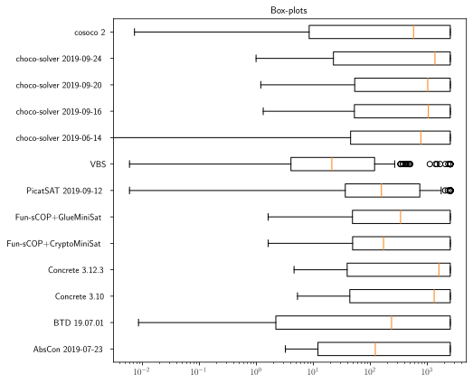
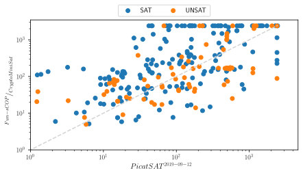

Analyze a Campaign in *Metrics*
===============================

Once the YAML file is correctly configured (`Reading a Campaign into
Metrics <scalpel-config.html>`__), the analysis of data can started. To
analyze the campaign of experiments thanks to *Metrics*, you need to use
the *Wallet* module of *Metrics*. *Wallet* stands for *“Automated tooL
for expLoiting Experimental resulTs”* (*wALLET*).

To manipulate data, *Wallet* uses a `pandas
Dataframe <https://pandas.pydata.org/>`__. A dataframe is a table
composed of rows corresponding to experimentations (also denoted as
observations) and columns corresponding to the variables/metrics of an
experimentation.

It is not necessary to have wide knowledge about this library to
manipulate *Wallet* data but in order to have a better idea on how data
are manipulated, an example of a classical analysis dataframe is given:

+---+-----------------------------------------+-----------------+-------+
|   | input                                   | experiment_ware | cpu   |
|   |                                         |                 | _time |
+===+=========================================+=================+=======+
| 0 | XCSP17/AllInterva                       | BTD 19.07.01    | 0.0   |
|   | l/AllInterval-m1-s1/AllInterval-035.xml |                 | 31203 |
+---+-----------------------------------------+-----------------+-------+
| 1 | XCSP17/AllInterva                       | choco-solver    | 1.    |
|   | l/AllInterval-m1-s1/AllInterval-035.xml | 2019-09-16      | 51053 |
+---+-----------------------------------------+-----------------+-------+
| 2 | XCSP17/AllInterva                       | choco-solver    | 1.    |
|   | l/AllInterval-m1-s1/AllInterval-035.xml | 2019-09-20      | 52427 |
+---+-----------------------------------------+-----------------+-------+
| 3 | XCSP17/AllInterva                       | choco-solver    | 1.    |
|   | l/AllInterval-m1-s1/AllInterval-035.xml | 2019-06-14      | 60424 |
+---+-----------------------------------------+-----------------+-------+
| 4 | XCSP17/AllInterva                       | AbsCon          | 3.    |
|   | l/AllInterval-m1-s1/AllInterval-035.xml | 2019-07-23      | 65329 |
+---+-----------------------------------------+-----------------+-------+

For the next, the documentation focuses on the analysis of a CSP solver
competition (`XCSP’19 <http://www.cril.univ-artois.fr/XCSP19/>`__).

A Preview of What is Able to Do an ``Analysis``
-----------------------------------------------

.. figure:: fig/analysis_uml.png
   :alt: Class diagram of an Analysis

   Class diagram of an Analysis

Globally, the Analysis object is composed of five parts:

-  ``getters`` to get basical objects from the analysis
-  ``checkers`` that permit to check many important information about
   the analysis
-  ``manipulations`` that permit to manipulate the state of the analysis
-  ``figures`` that permit to draw some tables and plots representing
   the data
-  ``others`` that correspond to operations like exporting.

Create/Import/Export an Analysis
--------------------------------

The Classical Analysis Object
~~~~~~~~~~~~~~~~~~~~~~~~~~~~~

To create a new analysis, you only need to import the ``Analysis`` class
from *Wallet* module and instantiate a new ``Analysis`` object with the
path to the YAML configuration file:

.. code:: python

   from metrics.wallet import Analysis
   analysis = Analysis(input_file='path/to/xcsp19/YAML/file')

The analysis is composed of many variables describing the experiments:
\* necessary ones: ``input``, ``experiment_ware``, ``cpu_time``,
``timeout`` \* optional ones (given by the current competition file):
``Category``, ``Checked answer``, ``Objective function``,
``Wallclock time``, ``Memory``, ``Solver name``, ``Solver version``.

These variables permit to check the consistency and the validity of
information. Some methods, called checkers, permit to operate some basic
operations:

-  ``<analysis>.check_success(<lambda>)``: given a lambda, this method
   permits to check if an experiment is a success or not (this method is
   automatically executed when the user has informed it in the Scalpel
   file);
-  ``<analysis>.check_missing_experiments()``: this method is
   automatically called by the ``Analysis`` constructor to replace
   missing experiments by unsuccessful experiments;
-  ``<analysis>.check_xp_consistency(<lambda>)``: given a lambda, this
   method permits to check the consistency for each experiment;
-  ``<analysis>.check_input_consistency(<lambda>)``: given a lambda,
   this method permits to check the consistency for each input (composed
   of many experiments); it asks some basic knowledge on DataFrame
   manipulation (an example is given by the next).

``check_success`` and ``check_missing_experiments`` are automatically
called during the Analysis constructor call. After, the user could
(re-)check these success and consistency methods as follow:

.. code:: python

   inconsistent_returns = {
       'ERR WRONGCERT', 'ERR UNSAT'
   }

   successful_returns = {'SAT', 'UNSAT'}

   is_consistent_by_xp = (lambda x: not x['Checked answer'] in inconsistent_returns)
   is_consistent_by_input = (lambda df: len(set(df['Checked answer'].unique()) & successful_returns) < 2)
   is_success = (lambda x: x['Checked answer'] in successful_returns)

   analysis.check_success(is_success)
   analysis.check_input_consistency(is_consistent_by_input)
   analysis.check_xp_consistency(is_consistent_by_xp)

The ``Analysis`` construction warns the user when inconsistencies are
found, missing data, …:

::

   1 experiment is missing and has been added as unsuccessful.
   4 experiments are inconsistent and are declared as unsuccessful.
   1 input is inconsistent and linked experiments are now declared as unsuccessful.

The analysis creates also its own variables corresponding to the
previous checkings: ``error``, ``success``, ``missing``
``consistent_xp`` and ``consistent_input``.

It exists another way to build an analysis that is presented in the
``Advanced Usage`` section.

Export and Import an Analysis
~~~~~~~~~~~~~~~~~~~~~~~~~~~~~

At any moment, the analysis could be exported to save its state in a
file:

.. code:: python

   analysis.export('analysis.csv')

An analysis could be exported as a csv (as a ``DataFrame``
representation) if the ``.csv`` extension is precised, else the analysis
is exported as a binary object.

To import an analysis from a file, the function
``import_analysis_from_file`` is imported:

.. code:: python

   from metrics.wallet import import_analysis
   imported_analysis = import_analysis_from_file(filepath)

..

   You can observe an example of these functions in `this
   notebook <https://github.com/crillab/metrics/blob/master/example/example/xcsp-19/create_analysis.ipynb>`__.

Manipulate the Data from Analysis
---------------------------------

Before producing the first figures, *Wallet* proposes to manipulate the
different experiments composing the dataframe. It allows to analyze more
finely the campaign.

Generate a New Information/Variable for Each Experiment
~~~~~~~~~~~~~~~~~~~~~~~~~~~~~~~~~~~~~~~~~~~~~~~~~~~~~~~

*Wallet* can add new information to the underlying dataframe by giving a
function/lambda to a mapping method of ``Analysis``. For the next
example, the input name corresponds to the path of the input (e.g.,
``/XCSPxx/family/.../input-parameters.xcsp``). It could be interesting
to extract the family name to use it in the rest of the analysis. For
this, the method ``add_variable()`` from ``Analysis``:

.. code:: python

   import re
   family_re = re.compile(r'^XCSP\d\d/(.*?)/')

   new_analysis = analysis.add_variable(
       new_var='family', 
       function=lambda x: family_re.match(x['input']).group(1)
   )

``add_variable()`` takes as first parameter the name of the future
created column, and as second parameter the lambda that applies the
regular expression ``family_re`` to the variable ``input`` of the row
``x`` (the regular expression returns an object corresponding to the
matching strings: ``.group(1)`` permits to retrieve the family name of
the input).

The result (as a sample of 5 experiments with the only 2 interesting
columns shown) is:

+----+----------------------------------------------------+------------+
|    | input                                              | family     |
+====+====================================================+============+
| 36 | XCSP17/Primes/Primes-m1-p25/Primes-25-80-2-7.xml   | Primes     |
| 41 |                                                    |            |
+----+----------------------------------------------------+------------+
| 29 | XCSP17                                             | MaxCSP     |
| 92 | /MaxCSP/MaxCSP-maxclique-s1/MaxCSP-brock-800-2.xml |            |
+----+----------------------------------------------------+------------+
| 29 | XCSP17/Mag                                         | M          |
| 56 | icSquare/MagicSquare-sum-s1/MagicSquare-13-sum.xml | agicSquare |
+----+----------------------------------------------------+------------+
| 71 | XCSP18/GracefulGraph/GracefulGraph-K05-P02_c18.xml | Gra        |
| 06 |                                                    | cefulGraph |
+----+----------------------------------------------------+------------+
| 44 | XCSP                                               | QRandom    |
| 23 | 17/QRandom/QRandom-mdd-7-25-5/mdd-7-25-5-56-09.xml |            |
+----+----------------------------------------------------+------------+

Thanks to this method, the user is also able to update existing columns
(e.g., renaming the experiment-wares to simplify their names).

   You can observe an example of this command in `this
   notebook <https://github.com/crillab/metrics/blob/master/example/xcsp-19/create_analysis.ipynb>`__.

Remove Variables from the Analysis
~~~~~~~~~~~~~~~~~~~~~~~~~~~~~~~~~~

Sometimes, some analysis information are not useful: it could be
interesting to simplify and lighten the dataframe (e.g., when we need to
export the analysis in a lighter format). To do this:

.. code:: python

   analysis.remove_variables(
       vars=['Category', 'Objective function']
   )

where ``vars`` parameter take the list of variables to remove.

Add an Analysis or a DataFrame to the current Analysis
~~~~~~~~~~~~~~~~~~~~~~~~~~~~~~~~~~~~~~~~~~~~~~~~~~~~~~

When many campaigns needs to be compared and two analysis ``a1`` and
``a2`` have been created, it is possible de merge them:

.. code:: python

   a3 = a1.add_analysis(a2)

The user has to be careful to merge consistent data: the new analysis
needs to contain the Cartesian product of the available inputs in its
dataframe with the experiment-wares. To ensure this and the consistency
of its analysis, the user can also apply the lambda as described for the
Analysis construction.

In the same way, it is possible to append the analysis with a consistent
dataframe:

.. code:: python

   a3 = a1.add_data_frame(a2.data_frame)

Add a Virtual Experiment-Ware
~~~~~~~~~~~~~~~~~~~~~~~~~~~~~

Sometimes, it may be interesting to introduce what we call a *Virtual
Experiment-Ware* (VEW), which generalizes the well-known *Virtual Best
Solver* (VBS). It allows to compare our current experiment-wares to the
virtual (best) one. A VBEW (*Virtual Best Experiment-Ware*) selects the
best experiment for each input from a selection of real experiment-ware
thanks to the function ``find_best_cpu_time_input``:

.. code:: python

   from metrics.wallet import find_best_cpu_time_input

   analysis_plus_vbs = analysis.add_virtual_experiment_ware(
       function=find_best_cpu_time_input, 
       xp_ware_set=None, # None corresponds to the all available experiment-wares of the analysis
       name='my_best_solver'
   )

Here, we create a VBEW named ``my_best_solver`` and based on the best
performances of the overall set of experiment-wares. ``my_best_solver``
will receive the result of one of these experiment-wares minimizing the
``cpu_time`` column.

``find_best_cpu_time_input`` is a function using some basic knownledge
about dataframe. As an example, ``find_best_cpu_time_input``
representation is shown:

.. code:: python

   def find_best_cpu_time_input(df):
       s = df['cpu_time']
       return df[s == s.min()]

``find_best_cpu_time_input`` receives a dataframe composed of the
experiments composing a given input. It finds the minimal ``cpu_time``
value and returns the row corresponding to this best time.

   You can observe an example of this method in `this
   notebook <https://github.com/crillab/metrics/blob/master/example/example/xcsp-19/create_analysis.ipynb>`__.

Subset of ``Analysis`` Rows
~~~~~~~~~~~~~~~~~~~~~~~~~~~

``Analysis`` is also able to make a subset of its experiments.

By Filtering Inputs
^^^^^^^^^^^^^^^^^^^

By default, it exists some useful subset methods in ``Analysis`` object
to filter input (and linked experiments):

-  ``keep_common_failed_inputs()``: returns a new ``Analysis`` with only
   the common failed experiments. It corresponds to inputs for which no
   experiment-ware has succeeded;
-  ``keep_common_solved_inputs()``: returns a new ``Analysis`` with only
   the common successful experiments. It corresponds to inputs for which
   no experiment-ware has failed;
-  ``delete_common_failed_inputs()``: returns a new ``Analysis`` where
   commonly failed inputs are removed;
-  ``delete_common_solved_inputs()``: returns a new ``Analysis`` where
   commonly succeeded inputs are removed.

Finally, we present a last and generic method to make a subset of
inputs:

.. code:: python

   analysis.filter_inputs(
       function=<lambda>,
       how=<all|any>
   )

The ``filter_inputs`` method takes two parameters: - ``function``
corresponds to a True/False lambda that says if an experiment (from
input experiments) is acceptable or not - ``how`` corresponds to the
need to have at least one or all the experiments from input acceptables.

As examples, we show how the four default methods are set with this
generic one:

+-----------------------------------+-----------------------------------+
| Default method                    | Implementation                    |
+===================================+===================================+
| ``delete_common_failed_inputs``   | ``an                              |
|                                   | alysis.filter_inputs(function=lam |
|                                   | bda x: x['success'], how='any')`` |
+-----------------------------------+-----------------------------------+
| ``delete_common_solved_inputs``   | ``analys                          |
|                                   | is.filter_inputs(function=lambda  |
|                                   | x: not x['success'], how='any')`` |
+-----------------------------------+-----------------------------------+
| ``keep_common_failed_inputs``     | ``analys                          |
|                                   | is.filter_inputs(function=lambda  |
|                                   | x: not x['success'], how='all')`` |
+-----------------------------------+-----------------------------------+
| ``keep_common_solved_inputs``     | ``an                              |
|                                   | alysis.filter_inputs(function=lam |
|                                   | bda x: x['success'], how='all')`` |
+-----------------------------------+-----------------------------------+

..

   You can observe an example of this subset in `this
   notebook <https://github.com/crillab/metrics/blob/master/example/example/xcsp-19/create_analysis.ipynb>`__.

By Filtering Experiments
^^^^^^^^^^^^^^^^^^^^^^^^

Analysis permits also to precise what are the experiments that the user
wants to filter:

.. code:: python

   analysis_no_para = analysis.filter_analysis(
       function=lambda x: 'parallel' not in x['experiment_ware']
   )

The previous example permits to remove all the solvers containing the
term *parallel* in its title.

Derived from this previous generic method, some default actions are also
existing:

+-----------------------------------+-----------------------------------+
| Default method                    | Implementation                    |
+===================================+===================================+
| `                                 | ``analysis.filter_a               |
| `remove_experiment_wares(<set>)`` | nalysis(lambda x: x[EXPERIMENT_XP |
|                                   | _WARE] not in experiment_wares)`` |
+-----------------------------------+-----------------------------------+
| ``keep_experiment_wares(<set>)``  | ``analysis.filt                   |
|                                   | er_analysis(lambda x: x[EXPERIMEN |
|                                   | T_XP_WARE] in experiment_wares)`` |
+-----------------------------------+-----------------------------------+

Grouping the Analysis
~~~~~~~~~~~~~~~~~~~~~

To group the analysis into specific analysis, two more methods are
presented: the classical ``groupby`` method and another one to group
experiment-wares by pairs.

``groupby`` Operator
^^^^^^^^^^^^^^^^^^^^

The ``groupby`` operator allows to create a list of new ``Analysis``
instances grouped by a column value. For example, if we have the family
name ``family`` of inputs in the dataframe, it could be interesting to
make separated analysis of each of them:

.. code:: python

   for sub_analysis in analysis.groupby('family'):
       print(sub_analysis.description_table())

These previous lines will describe the analysis of each family of
``my_analysis``.

Pairs of Experiment-wares
^^^^^^^^^^^^^^^^^^^^^^^^^

To compare more precisely the overall pairs of experiment-wares, a
method is implemented to return the corresponding analysis:

.. code:: python

   for sub_analysis in analysis.all_experiment_ware_pair_analysis():
       print(sub_analysis.description_table())

Draw Figures
------------

After having built the analysis and manipulated the data we want to
highlight, we can start drawing figures. Thanks to *Wallet*, we are able
to build two kinds of plots: static and dynamic.

*Wallet* permits to draw static plots and computing tables showing
different statistic measures. These figures can easily be exported in a
format specified by the user, such as LaTeX for tables and PNG or
vectorial graphics (such as SVG or EPS) for plots. Static plots are
highly configurable in order to fit in their final destination (e.g., in
slides or articles).

Static Tables
~~~~~~~~~~~~~

Each table that will be described hereafter are exportable into the
LaTeX format. In addition to this transformation, it is possible to
personnalize the the number pattern:

-  ``dollars_for_number`` puts numbers in math mode (for LaTeX outputs);
-  ``commas_for_number`` splits numbers with commas in math mode (for
   LaTeX outputs).

..

   Each table generated are observable in `this
   notebook <https://github.com/crillab/metrics/blob/master/example/example/xcsp-19/tables_from_analysis.ipynb>`__.

Describe the Current Analysis
^^^^^^^^^^^^^^^^^^^^^^^^^^^^^

Before manipulating the analysis, it could be interesting to describe
it:

.. code:: python

   analysis.description_table()

which yields the following:

============================== ===================================
\                              analysis
============================== ===================================
n_experiment_wares             13
n_inputs                       300
n_experiments                  3900
n_missing_xp                   0
n_inconsistent_xp              2
n_inconsistent_xp_due_to_input 0
more_info_about_variables      .data_frame.describe(include=‘all’)
============================== ===================================

This first method allows to fastly understand how is composed the
campaign. Here, simple statistics are shown, as the number of
experiment-wares, inputs, experiments or missing ones, but one can also
show exhaustively the different variable descriptions by applying
``<analysis>.data_frame.describe(include='all')``.

Describe the Errors
^^^^^^^^^^^^^^^^^^^

If it exists missing data, the *Wallet* analysis can print a table
showing what are these missing experiments by calling:

.. code:: python

   analysis.error_table()

which yields the following:

+---+------+------+---+----+----+---+---+----+---+---+---+---+---+----+---+---+
|   | i    | exp  | c | C  | W  | M | S | So | t | s | u | m | c | co | e | f |
|   | nput | erim | p | he | al | e | o | lv | i | u | s | i | o | ns | r | a |
|   |      | ent_ | u | ck | lc | m | l | er | m | c | e | s | n | is | r | m |
|   |      | ware | _ | ed | lo | o | v | v  | e | c | r | s | s | te | o | i |
|   |      |      | t | an | ck | r | e | er | o | e | _ | i | i | nt | r | l |
|   |      |      | i | sw | ti | y | r | si | u | s | s | n | s | _i |   | y |
|   |      |      | m | er | me |   | n | on | t | s | u | g | t | np |   |   |
|   |      |      | e |    |    |   | a |    |   |   | c |   | e | ut |   |   |
|   |      |      |   |    |    |   | m |    |   |   | c |   | n |    |   |   |
|   |      |      |   |    |    |   | e |    |   |   | e |   | t |    |   |   |
|   |      |      |   |    |    |   |   |    |   |   | s |   | _ |    |   |   |
|   |      |      |   |    |    |   |   |    |   |   | s |   | x |    |   |   |
|   |      |      |   |    |    |   |   |    |   |   |   |   | p |    |   |   |
+===+======+======+===+====+====+===+===+====+===+===+===+===+===+====+===+===+
| 3 | XCS  | co   | 0 | E  | 0  | 0 | c | 2  | 2 | F | F | F | F | Tr | T | h |
| 5 | P19/ | soco | . | RR | .0 |   | o |    | 4 | a | a | a | a | ue | r | c |
| 7 | hcp/ | 2    | 0 | U  | 45 |   | s |    | 0 | l | l | l | l |    | u | p |
| 6 | grap |      | 4 | NS | 14 |   | o |    | 0 | s | s | s | s |    | e |   |
|   | h255 |      | 5 | AT | 21 |   | c |    |   | e | e | e | e |    |   |   |
|   | .xml |      | 4 |    |    |   | o |    |   |   |   |   |   |    |   |   |
|   |      |      | 1 |    |    |   |   |    |   |   |   |   |   |    |   |   |
|   |      |      | 8 |    |    |   |   |    |   |   |   |   |   |    |   |   |
+---+------+------+---+----+----+---+---+----+---+---+---+---+---+----+---+---+
| 3 | XC   | choc | 2 | E  | 5  | 1 | c | 20 | 2 | F | F | F | F | Tr | T | h |
| 5 | SP19 | o-so | 3 | RR | 83 | . | h | 19 | 4 | a | a | a | a | ue | r | c |
| 9 | /hcp | lver | 0 | W  | .6 | 5 | o | -0 | 0 | l | l | l | l |    | u | p |
| 6 | /gra | 20   | 6 | RO | 97 | 5 | c | 9- | 0 | s | s | s | s |    | e |   |
|   | ph48 | 19-0 | . | NG |    | 3 | o | 16 |   | e | e | e | e |    |   |   |
|   | .xml | 9-16 | 8 | CE |    | 0 | - |    |   |   |   |   |   |    |   |   |
|   |      |      | 5 | RT |    | 5 | s |    |   |   |   |   |   |    |   |   |
|   |      |      |   |    |    | e | o |    |   |   |   |   |   |    |   |   |
|   |      |      |   |    |    | + | l |    |   |   |   |   |   |    |   |   |
|   |      |      |   |    |    | 0 | v |    |   |   |   |   |   |    |   |   |
|   |      |      |   |    |    | 7 | e |    |   |   |   |   |   |    |   |   |
|   |      |      |   |    |    |   | r |    |   |   |   |   |   |    |   |   |
+---+------+------+---+----+----+---+---+----+---+---+---+---+---+----+---+---+

The Statistic Table
^^^^^^^^^^^^^^^^^^^

The table allows to show a global overview of the results through the
following statistics:

-  ``count`` is the number of solved inputs for a given experiment-ware;
-  ``sum`` is the time taken by the experiment-ware to solve (or not)
   inputs (including timeout inputs);
-  ``PARx`` is equivalent to ``sum`` but adds a penalty of ``x`` times
   the timeout to failed experiments (*PAR* stands for *Penalised
   Average Runtime*);
-  ``common count`` is the number of inputs commonly solved by all the
   experiment-wares;
-  ``common sum`` is the time taken to solve the commonly solved inputs;
-  ``uncommon count`` corresponds to the number of inputs solved by an
   experiment-ware less the common ones (the common ones could be
   considered as easy inputs);
-  ``total`` the total number of experiments for a given
   experiment-ware.

.. code:: python

   analysis.stat_table(
       output='output/stat_table.tex',
       commas_for_number=True,
       dollars_for_number=True,
   )

This table is given by calling the previous method with different
parameters: - ``par`` corresponds to the different values we want to
give to the PARx column(s); - ``output`` is the path to the output we
want to produce (e.g., a LaTeX table).

+-------------------+---+---+---+---+-------+------+-----+-------+---+
| experiment_ware   | c | s | P | P | PAR10 | co   | com | unc   | t |
|                   | o | u | A | A |       | mmon | mon | ommon | o |
|                   | u | m | R | R |       | c    | sum | count | t |
|                   | n |   | 1 | 2 |       | ount |     |       | a |
|                   | t |   |   |   |       |      |     |       | l |
+===================+===+===+===+===+=======+======+=====+=======+===+
| VBS               | 2 | 9 | 9 | 1 | 7     | 65   | 405 | 205   | 3 |
|                   | 7 | 0 | 0 | 6 | 38388 |      |     |       | 0 |
|                   | 0 | 3 | 3 | 2 |       |      |     |       | 0 |
|                   |   | 8 | 8 | 3 |       |      |     |       |   |
|                   |   | 8 | 8 | 8 |       |      |     |       |   |
|                   |   |   |   | 8 |       |      |     |       |   |
+-------------------+---+---+---+---+-------+------+-----+-------+---+
| PicatSAT          | 2 | 1 | 1 | 3 | 1     | 65   | 11  | 181   | 3 |
| 2019-09-12        | 4 | 9 | 9 | 2 | .3587 |      | 093 |       | 0 |
|                   | 6 | 2 | 2 | 1 | 8e+06 |      |     |       | 0 |
|                   |   | 3 | 3 | 9 |       |      |     |       |   |
|                   |   | 7 | 7 | 7 |       |      |     |       |   |
|                   |   | 7 | 7 | 7 |       |      |     |       |   |
+-------------------+---+---+---+---+-------+------+-----+-------+---+
| Fun-sCOP          | 2 | 2 | 2 | 4 | 2     | 65   | 16  | 144   | 3 |
| hyb               | 0 | 7 | 7 | 9 | .2399 |      | 472 |       | 0 |
| rid+CryptoMiniSat | 9 | 4 | 4 | 2 | 2e+06 |      |     |       | 0 |
| (2019-06-15)      |   | 3 | 3 | 7 |       |      |     |       |   |
|                   |   | 2 | 2 | 2 |       |      |     |       |   |
|                   |   | 3 | 3 | 3 |       |      |     |       |   |
+-------------------+---+---+---+---+-------+------+-----+-------+---+
| Fun-sCOP          | 1 | 3 | 3 | 5 | 2     | 65   | 14  | 125   | 3 |
| order+GlueMiniSat | 9 | 2 | 2 | 8 | .6960 |      | 632 |       | 0 |
| (2019-06-15)      | 0 | 0 | 0 | 4 | 7e+06 |      |     |       | 0 |
|                   |   | 0 | 0 | 0 |       |      |     |       |   |
|                   |   | 7 | 7 | 7 |       |      |     |       |   |
|                   |   | 0 | 0 | 0 |       |      |     |       |   |
+-------------------+---+---+---+---+-------+------+-----+-------+---+
| AbsCon 2019-07-23 | 1 | 3 | 3 | 6 | 3     | 65   | 2   | 103   | 3 |
|                   | 6 | 4 | 4 | 5 | .1925 |      | 805 |       | 0 |
|                   | 8 | 1 | 1 | 8 | 9e+06 |      |     |       | 0 |
|                   |   | 3 | 3 | 1 |       |      |     |       |   |
|                   |   | 8 | 8 | 8 |       |      |     |       |   |
|                   |   | 7 | 7 | 7 |       |      |     |       |   |
+-------------------+---+---+---+---+-------+------+-----+-------+---+
| choco-solver      | 1 | 3 | 3 | 6 | 3     | 65   | 7   | 103   | 3 |
| 2019-06-14        | 6 | 6 | 6 | 8 | .2210 |      | 875 |       | 0 |
|                   | 8 | 9 | 9 | 6 | 5e+06 |      |     |       | 0 |
|                   |   | 8 | 8 | 6 |       |      |     |       |   |
|                   |   | 4 | 4 | 4 |       |      |     |       |   |
|                   |   | 6 | 6 | 6 |       |      |     |       |   |
+-------------------+---+---+---+---+-------+------+-----+-------+---+
| Concrete 3.10     | 1 | 3 | 3 | 6 | 3     | 65   | 5   | 100   | 3 |
|                   | 6 | 6 | 6 | 9 | .2856 |      | 182 |       | 0 |
|                   | 5 | 9 | 9 | 3 | 2e+06 |      |     |       | 0 |
|                   |   | 6 | 6 | 6 |       |      |     |       |   |
|                   |   | 1 | 1 | 1 |       |      |     |       |   |
|                   |   | 5 | 5 | 5 |       |      |     |       |   |
+-------------------+---+---+---+---+-------+------+-----+-------+---+
| choco-solver      | 1 | 3 | 3 | 6 | 3     | 65   | 7   | 100   | 3 |
| 2019-09-16        | 6 | 7 | 7 | 9 | .2882 |      | 790 |       | 0 |
|                   | 5 | 2 | 2 | 6 | 7e+06 |      |     |       | 0 |
|                   |   | 2 | 2 | 2 |       |      |     |       |   |
|                   |   | 6 | 6 | 6 |       |      |     |       |   |
|                   |   | 6 | 6 | 6 |       |      |     |       |   |
+-------------------+---+---+---+---+-------+------+-----+-------+---+
| choco-solver      | 1 | 3 | 3 | 6 | 3     | 65   | 7   | 100   | 3 |
| 2019-09-20        | 6 | 7 | 7 | 9 | .2883 |      | 754 |       | 0 |
|                   | 5 | 2 | 2 | 6 | 2e+06 |      |     |       | 0 |
|                   |   | 3 | 3 | 3 |       |      |     |       |   |
|                   |   | 1 | 1 | 1 |       |      |     |       |   |
|                   |   | 6 | 6 | 6 |       |      |     |       |   |
+-------------------+---+---+---+---+-------+------+-----+-------+---+
| Concrete 3.12.3   | 1 | 3 | 3 | 7 | 3     | 65   | 7   | 91    | 3 |
|                   | 5 | 8 | 8 | 3 | .4966 |      | 198 |       | 0 |
|                   | 6 | 6 | 6 | 1 | 8e+06 |      |     |       | 0 |
|                   |   | 2 | 2 | 8 |       |      |     |       |   |
|                   |   | 7 | 7 | 7 |       |      |     |       |   |
|                   |   | 6 | 6 | 6 |       |      |     |       |   |
+-------------------+---+---+---+---+-------+------+-----+-------+---+
| choco-solver      | 1 | 3 | 3 | 7 | 3     | 65   | 2   | 84    | 3 |
| 2019-09-24        | 4 | 9 | 9 | 5 | .6522 |      | 570 |       | 0 |
|                   | 9 | 0 | 0 | 3 | 3e+06 |      |     |       | 0 |
|                   |   | 6 | 6 | 0 |       |      |     |       |   |
|                   |   | 3 | 3 | 3 |       |      |     |       |   |
|                   |   | 4 | 4 | 4 |       |      |     |       |   |
+-------------------+---+---+---+---+-------+------+-----+-------+---+
| BTD 19.07.01      | 1 | 4 | 4 | 8 | 3     | 65   | 6   | 70    | 3 |
|                   | 3 | 2 | 2 | 1 | .9850 |      | 718 |       | 0 |
|                   | 5 | 1 | 1 | 7 | 9e+06 |      |     |       | 0 |
|                   |   | 0 | 0 | 0 |       |      |     |       |   |
|                   |   | 8 | 8 | 8 |       |      |     |       |   |
|                   |   | 7 | 7 | 7 |       |      |     |       |   |
+-------------------+---+---+---+---+-------+------+-----+-------+---+
| cosoco 2          | 1 | 4 | 4 | 8 | 4     | 65   | 6   | 62    | 3 |
|                   | 2 | 4 | 4 | 6 | .1852 |      | 810 |       | 0 |
|                   | 7 | 8 | 8 | 3 | 2e+06 |      |     |       | 0 |
|                   |   | 4 | 4 | 6 |       |      |     |       |   |
|                   |   | 2 | 2 | 2 |       |      |     |       |   |
|                   |   | 5 | 5 | 5 |       |      |     |       |   |
+-------------------+---+---+---+---+-------+------+-----+-------+---+

The Pivot Table
^^^^^^^^^^^^^^^

The pivot table allows to show exhaustively a precise variable between
the set of experiment-wares (rows) and inputs (cols).

.. code:: python

   analysis.pivot_table(
       index='input', 
       columns='experiment_ware', 
       values='cpu_time',
       output='output/pivot_table.tex',
       commas_for_number=True,
       dollars_for_number=True,
   )#.head()

-  ``index`` permits to precise what we want in the rows;
-  ``columns`` permits to precise what we want in the cols;
-  ``values`` permits to precise what we want to show in the cells as
   information crossing ``index`` and ``columns``.

+----------+---+---+---+---+-------+-------+---+---+----+----+----+----+---+
| input    | A | B | C | C | Fun   | Fun   | P | V | ch | ch | ch | ch | c |
|          | b | T | o | o | -sCOP | -sCOP | i | B | oc | oc | oc | oc | o |
|          | s | D | n | n | hybri | or    | c | S | o- | o- | o- | o- | s |
|          | C | 1 | c | c | d+Cry | der+G | a |   | so | so | so | so | o |
|          | o | 9 | r | r | ptoMi | lueMi | t |   | lv | lv | lv | lv | c |
|          | n | . | e | e | niSat | niSat | S |   | er | er | er | er | o |
|          | 2 | 0 | t | t | (2    | (2    | A |   | 20 | 20 | 20 | 20 | 2 |
|          | 0 | 7 | e | e | 019-0 | 019-0 | T |   | 19 | 19 | 19 | 19 |   |
|          | 1 | . | 3 | 3 | 6-15) | 6-15) | 2 |   | -0 | -0 | -0 | -0 |   |
|          | 9 | 0 | . | . |       |       | 0 |   | 6- | 9- | 9- | 9- |   |
|          | - | 1 | 1 | 1 |       |       | 1 |   | 14 | 16 | 20 | 24 |   |
|          | 0 |   | 0 | 2 |       |       | 9 |   |    |    |    |    |   |
|          | 7 |   |   | . |       |       | - |   |    |    |    |    |   |
|          | - |   |   | 3 |       |       | 0 |   |    |    |    |    |   |
|          | 2 |   |   |   |       |       | 9 |   |    |    |    |    |   |
|          | 3 |   |   |   |       |       | - |   |    |    |    |    |   |
|          |   |   |   |   |       |       | 1 |   |    |    |    |    |   |
|          |   |   |   |   |       |       | 2 |   |    |    |    |    |   |
+==========+===+===+===+===+=======+=======+===+===+====+====+====+====+===+
| XCSP17/A | 3 | 0 | 8 | 9 | 11    | 14    | 2 | 0 | 1  | 1  | 1  | 6  | 1 |
| llInterv | . | . | 1 | . | .6944 | .1492 | 2 | . | .6 | .5 | .5 | 9. | 4 |
| al/AllIn | 6 | 0 | . | 8 |       |       | 8 | 0 | 04 | 10 | 24 | 12 | . |
| terval-m | 5 | 3 | 2 | 0 |       |       | . | 3 | 24 | 53 | 27 | 19 | 9 |
| 1-s1/All | 3 | 1 | 1 | 9 |       |       | 6 | 1 |    |    |    |    | 1 |
| Interval | 2 | 2 | 4 | 9 |       |       | 4 | 2 |    |    |    |    | 9 |
| -035.xml | 9 | 0 | 6 | 3 |       |       | 4 | 0 |    |    |    |    |   |
|          |   | 3 |   |   |       |       |   | 3 |    |    |    |    |   |
+----------+---+---+---+---+-------+-------+---+---+----+----+----+----+---+
| XCSP17/A | 3 | 0 | 1 | 1 | 14    | 14    | 2 | 0 | 1  | 1  | 1  | 4  | 0 |
| llInterv | . | . | 2 | 8 | .8833 | .6022 | 9 | . | .6 | .7 | .5 | 6. | . |
| al/AllIn | 7 | 0 | 7 | 9 |       |       | 0 | 0 | 88 | 53 | 79 | 75 | 3 |
| terval-m | 7 | 4 | . | . |       |       | . | 4 | 56 | 39 | 38 | 05 | 4 |
| 1-s1/All | 1 | 5 | 2 | 8 |       |       | 3 | 5 |    |    |    |    | 7 |
| Interval | 3 | 3 | 4 | 4 |       |       | 2 | 3 |    |    |    |    | 6 |
| -040.xml | 2 | 7 | 1 | 1 |       |       | 8 | 7 |    |    |    |    | 6 |
|          |   | 5 |   |   |       |       |   | 5 |    |    |    |    | 1 |
+----------+---+---+---+---+-------+-------+---+---+----+----+----+----+---+
| XCSP     | 2 | 2 | 2 | 2 | 25    | 25    | 2 | 1 | 2  | 2  | 2  | 2  | 1 |
| 17/Bibd/ | 5 | 5 | 5 | 5 | 20.44 | 20.28 | 5 | 4 | 52 | 52 | 52 | 52 | 4 |
| Bibd-sc- | 2 | 1 | 2 | 2 |       |       | 2 | 0 | 0. | 0. | 0. | 0. | 0 |
| open/Bib | 0 | 9 | 0 | 0 |       |       | 0 | . | 42 | 66 | 74 | 05 | . |
| d-sc-85- | . | . | . | . |       |       | . | 4 |    |    |    |    | 4 |
| 085-36-3 | 0 | 9 | 1 | 2 |       |       | 0 | 4 |    |    |    |    | 4 |
| 6-15.xml | 4 | 1 | 6 |   |       |       | 7 | 2 |    |    |    |    | 2 |
+----------+---+---+---+---+-------+-------+---+---+----+----+----+----+---+
| XCSP17   | 2 | 2 | 2 | 2 | 4     | 43    | 2 | 2 | 2  | 16 | 1  | 3  | 2 |
| /Bibd/Bi | 5 | 5 | 5 | 5 | 5.027 | .2998 | 1 | 1 | 52 | 66 | 68 | 79 | 5 |
| bd-sc-st | 2 | 1 | 2 | 2 |       |       | . | . | 0. | .8 | 0. | .2 | 1 |
| ab1/Bibd | 0 | 9 | 0 | 0 |       |       | 1 | 1 | 63 |    | 89 | 65 | 9 |
| -sc-25-0 | . | . | . | . |       |       | 7 | 7 |    |    |    |    | . |
| 5-01.xml | 1 | 8 | 1 | 1 |       |       | 5 | 5 |    |    |    |    | 7 |
|          |   | 9 | 1 | 2 |       |       | 1 | 1 |    |    |    |    | 5 |
+----------+---+---+---+---+-------+-------+---+---+----+----+----+----+---+
| XCSP17   | 2 | 2 | 2 | 2 | 16    | 25    | 5 | 1 | 1  | 2  | 2  | 2  | 2 |
| /Bibd/Bi | 5 | 5 | 5 | 5 | 89.17 | 20.14 | 1 | 3 | 37 | 60 | 11 | 52 | 5 |
| bd-sc-st | 2 | 1 | 2 | 2 |       |       | 5 | 7 | .5 | .3 | .4 | 0. | 2 |
| ab1/Bibd | 0 | 9 | 0 | 0 |       |       | . | . | 06 | 69 | 21 | 11 | 0 |
| -sc-25-0 | . | . | . | . |       |       | 6 | 5 |    |    |    |    | . |
| 9-03.xml | 1 | 7 | 1 | 0 |       |       | 6 | 0 |    |    |    |    | 0 |
|          | 1 | 7 |   | 7 |       |       | 4 | 6 |    |    |    |    | 2 |
+----------+---+---+---+---+-------+-------+---+---+----+----+----+----+---+

The output is truncated.

The Contribution Table
^^^^^^^^^^^^^^^^^^^^^^

This last table proposed by *Wallet* allowing to show the
**contribution** of each experiment-ware:

-  ``vbew simple`` corresponds to the number of times an experiment-ware
   has been selected in the VBEW;
-  ``vbew d`` corresponds to the number of times an experiment-ware
   solves an instance ``d`` second(s) faster than all other solvers;
-  ``contribution`` corresponds to the case that an experiment-ware is
   the only one that has been able to solve an input (a.k.a.
   state-of-the-art contribution).

As for the previous table, one just needs to call the following method:

.. code:: python

   analysis.remove_experiment_wares(['VBS']).contribution_table(
       output='output/contribution_table.tex',
       commas_for_number=True,
       dollars_for_number=True,
   )

NB: the previously created virtual experiment-ware *VBS* is removed to
avoid errors in the computations.

``deltas`` correspond to the list of ``vbew d`` we want to show in the
table.

+----------+----------+---------+----------+----------+----------+
| experim  | vbew     | vbew 1s | vbew 10s | vbew     | cont     |
| ent_ware | simple   |         |          | 100s     | ribution |
+==========+==========+=========+==========+==========+==========+
| BTD      | 76       | 28      | 11       | 1        | 0        |
| 19.07.01 |          |         |          |          |          |
+----------+----------+---------+----------+----------+----------+
| cosoco 2 | 59       | 35      | 17       | 9        | 5        |
+----------+----------+---------+----------+----------+----------+
| PicatSAT | 40       | 35      | 30       | 9        | 0        |
| 20       |          |         |          |          |          |
| 19-09-12 |          |         |          |          |          |
+----------+----------+---------+----------+----------+----------+
| Fun-sCOP | 38       | 38      | 35       | 18       | 0        |
| hybr     |          |         |          |          |          |
| id+Crypt |          |         |          |          |          |
| oMiniSat |          |         |          |          |          |
| (201     |          |         |          |          |          |
| 9-06-15) |          |         |          |          |          |
+----------+----------+---------+----------+----------+----------+
| AbsCon   | 19       | 19      | 15       | 1        | 0        |
| 20       |          |         |          |          |          |
| 19-07-23 |          |         |          |          |          |
+----------+----------+---------+----------+----------+----------+
| Fun-sCOP | 16       | 16      | 11       | 5        | 3        |
| o        |          |         |          |          |          |
| rder+Glu |          |         |          |          |          |
| eMiniSat |          |         |          |          |          |
| (201     |          |         |          |          |          |
| 9-06-15) |          |         |          |          |          |
+----------+----------+---------+----------+----------+----------+
| choc     | 14       | 14      | 6        | 1        | 0        |
| o-solver |          |         |          |          |          |
| 20       |          |         |          |          |          |
| 19-09-24 |          |         |          |          |          |
+----------+----------+---------+----------+----------+----------+
| choc     | 7        | 6       | 5        | 3        | 0        |
| o-solver |          |         |          |          |          |
| 20       |          |         |          |          |          |
| 19-06-14 |          |         |          |          |          |
+----------+----------+---------+----------+----------+----------+
| Concrete | 6        | 6       | 5        | 1        | 0        |
| 3.10     |          |         |          |          |          |
+----------+----------+---------+----------+----------+----------+
| Concrete | 4        | 4       | 4        | 0        | 0        |
| 3.12.3   |          |         |          |          |          |
+----------+----------+---------+----------+----------+----------+
| choc     | 3        | 3       | 2        | 1        | 0        |
| o-solver |          |         |          |          |          |
| 20       |          |         |          |          |          |
| 19-09-16 |          |         |          |          |          |
+----------+----------+---------+----------+----------+----------+
| choc     | 1        | 1       | 1        | 0        | 0        |
| o-solver |          |         |          |          |          |
| 20       |          |         |          |          |          |
| 19-09-20 |          |         |          |          |          |
+----------+----------+---------+----------+----------+----------+

Static Plots
~~~~~~~~~~~~

*Wallet* proposed many plots to show data. Static plots have some common
parameters:

-  ``figure_size``: size of the figure to output (inches);
-  ``title``: the figure title;
-  ``x_axis_name``: the x-label title;
-  ``y_axis_name``: the y-label title;
-  ``output``: output path to save the figure or ``None``;
-  ``color_map``: a map to force the color of each experiment-ware line;
-  ``style_map``: a map to force the line style of each experiment-ware
   line;
-  ``title_font_*``: the title font properties;
-  ``label_font_*``: the label font properties;
-  ``latex_writing``: if ``True``, allows to write in LaTeX mode;
-  ``logx``: log scale for the x-axis;
-  ``logy``: log scale for the y-axis;
-  ``[x|y]_[min|max]``: set the limit of an axis, or ``-1`` to take the
   default value of ``matplotlib``;
-  ``legend_location``: the four legend positions (Position.RIGHT,
   Position.LEFT, Position.TOP, Position.BOTTOM);
-  ``legend_offset``: a couple ``x`` and ``y`` as offsets for the
   current legend location;
-  ``ncol_legend``: number of columns for the legend (default: ``1``).

..

   A full example of a static plots is given in `this
   notebook <https://github.com/crillab/metrics/blob/master/example/example/xcsp-19/figures_from_analysis.ipynb>`__.

Static Cactus-Plot
^^^^^^^^^^^^^^^^^^

A first kind of plots that allows to consider an overview of all the
experiment-wares is the *cactus plot*. A cactus plot considers all
solved inputs of each experiment-ware. Each line in the plot represents
an experiment-ware. Inputs are ordered by solving time for each
experiment-ware to build this figure: the x-axis corresponds to the rank
of the solved input and the y-axis to the time taken to solve the input,
so that the righter the line, the better the solver. Note that we can
also cumulate the runtime of each solved inputs to get a smoother plot.

.. code:: python

   analysis.cactus_plot(
       # Cactus plot specificities
       cumulated=False,
       cactus_col='cpu_time',
       show_marker=False,

       # Figure size
       figure_size=(7, 3.5),

       # Titles
       title='Cactus-plot',
       x_axis_name='Number of solved inputs',
       y_axis_name='Time',

       # Axis limits
       x_min=50,
       x_max=None,
       y_min=None,
       y_max=None,

       # Axis scaling
       logx=False,
       logy=False,

       # Legend parameters
       legend_location=Position.RIGHT,
       legend_offset=(0, 0),
       ncol_legend=1,

       # Style mapping
       color_map={
           'VBS': '#000000'
       },
       style_map={
           'VBS': LineType.DASH_DOT,
       },

       # Title font styles
       title_font_name='Helvetica',
       title_font_color='#000000',
       title_font_size=11,
       title_font_weight=FontWeight.BOLD,

       # Label font styles
       label_font_name='Helvetica',
       label_font_color='#000000',
       label_font_size=11,
       label_font_weight=FontWeight.BOLD,

       # Others
       latex_writing=True,
       output="output/cactus.svg",
       dynamic=False
   )

.. image:: fig/cactus.svg

By default, the cactus plot draws its graphic by using the ``cpu_time``
of the results: you are free to change this behaviour by replacing the
``cactus_col`` parameter. You can ask this plot to cumulate the runtime
by giving ``cumulated=True``. We can show and hide markers thanks to
``show_marker`` parameter. The legend ordering corresponds to the
decreasing order of the number of solved inputs for each
experiment-ware.

Static CDF-Plot
^^^^^^^^^^^^^^^

Equivalently to cactus plot, one may instead use the so-called
*Cumulative Distribution Function* (CDF), which is well-known when
considering statistics. In this plot x-axis corresponds to the y-axis of
the cactus-plot (time), and the y-axis corresponds to the normalized
number of solved inputs. A point on the line of the CDF may be
interpreted as the probability to solve an input given a time limit.

.. code:: python

   analysis.cdf_plot(
       # Cactus plot specificities
       cumulated=False,
       cdf_col='cpu_time',
       show_marker=False,

       # Figure size
       figure_size=(7, 3.5),

       # Titles
       title='CDF-plot',
       x_axis_name='Time',
       y_axis_name='Number of solved inputs',

       # Axis limits
       x_min=None,
       x_max=None,
       y_min=None,
       y_max=None,

       # Axis scaling
       logx=False,
       logy=False,

       # Legend parameters
       legend_location=Position.RIGHT,
       legend_offset=(0, 0),
       ncol_legend=1,

       # Style mapping
       color_map={
           'VBS': '#000000'
       },
       style_map={
           'VBS': LineType.DASH_DOT,
       },

       # Title font styles
       title_font_name='Helvetica',
       title_font_color='#000000',
       title_font_size=11,
       title_font_weight=FontWeight.BOLD,

       # Label font styles
       label_font_name='Helvetica',
       label_font_color='#000000',
       label_font_size=11,
       label_font_weight=FontWeight.BOLD,

       # Others
       latex_writing=True,
       output="output/cdf.svg",
       dynamic=False
   )

.. image:: fig/cdf.svg

By default, the CDF plot draws its graphic by using the ``cpu_time`` of
results: you are free to change this behaviour by replacing the
``cdf_col`` parameter.

Static Box-Plot
^^^^^^^^^^^^^^^

In addition to cactus and CDF plots, one may consider *box plots* to get
more detailed results about the runtime of each solver. A box in such a
plot represents the distribution of each experiment time of a given
experiment-ware. In particular, such plots allow to easily locate
medians, quartiles and means for all experiment-wares in a single
figure. We can find a practical application of this plot in the case of
randomized algorithms: it permits to visualize the variance and to
simply compare the effect of changing the random function seed for a
given fixed solver configuration using it.

.. code:: python

   analysis.box_plot(
       # Box plot specificities
       box_col='cpu_time',

       # Figure size
       figure_size=(7, 7),

       # Titles
       title='Box-plots',
       x_axis_name=None,
       y_axis_name=None,

       # Axis limits
       x_min=None,
       x_max=None,

       # Axis scaling
       logx=True,

       # Title font styles
       title_font_name='Helvetica',
       title_font_color='#000000',
       title_font_size=11,
       title_font_weight=FontWeight.BOLD,

       # Label font styles
       label_font_name='Helvetica',
       label_font_color='#000000',
       label_font_size=11,
       label_font_weight=FontWeight.BOLD,

       # Others
       latex_writing=True,
       output="output/box.svg",
       dynamic=False
   )

By default, the box plot draw its graphic by using the ``cpu_time`` of
results: the user is free to change this behaviour by replacing the
``box_col`` parameter.

Static Scatter-Plot
^^^^^^^^^^^^^^^^^^^

Finally, to get a more detailed comparison of two experiment-wares, one
can use scatter plots. Each axis in this plot corresponds to an
experiment-ware and displays its runtime (between :math:``0`` and the
timeout). We can place each input in the plot as a point corresponding
to the time taken by both experiment-wares to solve this input. We can
quickly observe if there exists a trend for one experiment-ware or the
other in terms of efficiency.

.. code:: python

   rename = {
       "PicatSAT 2019-09-12": '$PicatSAT^{2019-09-12}$',
       "Fun-sCOP+CryptoMiniSat": '$^{Fun-sCOP}/_{CryptoMiniSat}$'
   }

   a2 = analysis.add_variable(
       'experiment_ware',
       lambda x: x['experiment_ware'] if x['experiment_ware'] not in rename else rename[x['experiment_ware']]
   )

   a2.scatter_plot(
               "$PicatSAT^{2019-09-12}$",
               "$^{Fun-sCOP}/_{CryptoMiniSat}$",
               scatter_col="cpu_time",
               title=None,
       
               color_col="Checked answer",
               x_min=1,
               x_max=None,
               y_min=1,
               y_max=None,
               logx=True,
               logy=True,

               figure_size=(7, 3.5),
               
               legend_location=Position.TOP,
               legend_offset=(0, -.1),
               ncol_legend=2,

               title_font_name='Helvetica',
               title_font_color='#000000',
               latex_writing=True,
               output="output/scatter.svg",
               dynamic=False
       )

To draw a scatter-plot, we need to specify the experiment-wares on the
x-axis and tge y-axis: ``xp_ware_x`` and ``xp_ware_y``. By default, the
scatter plot draw its graphic by using the ``cpu_time`` of results: you
are free to change this behaviour by replacing the ``scatter_col``
parameter.

Dynamic Plots
~~~~~~~~~~~~~

Dynamic plots can be called by simply setting the ``dynamic`` parameter
to ``True``.

For example:

.. code:: python

   my_analysis.get_scatter_plot(dynamic=True)

Advanced Usage
--------------

For a more advanced usage, it is possible to get the original *pandas
Dataframe* and to manipulate it thanks to this instruction:

.. code:: python

   df = analysis.data_frame

Then simply follow `pandas
documentation <https://pandas.pydata.org/docs/>`__ or more concisely
this `pandas cheat
sheet <https://pandas.pydata.org/Pandas_Cheat_Sheet.pdf>`__.

If the user keeps the minimal necessary information in the modified
dataframe, a new ``Analysis`` could be instanciated (with the optional
success and consistency lambda checkers):

.. code:: python

   analysis = Analysis(data_frame=modified_df)

Every previous static tables correspond to pandas DataFrame and are thus
manipulable.
